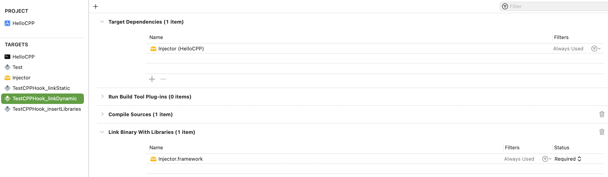
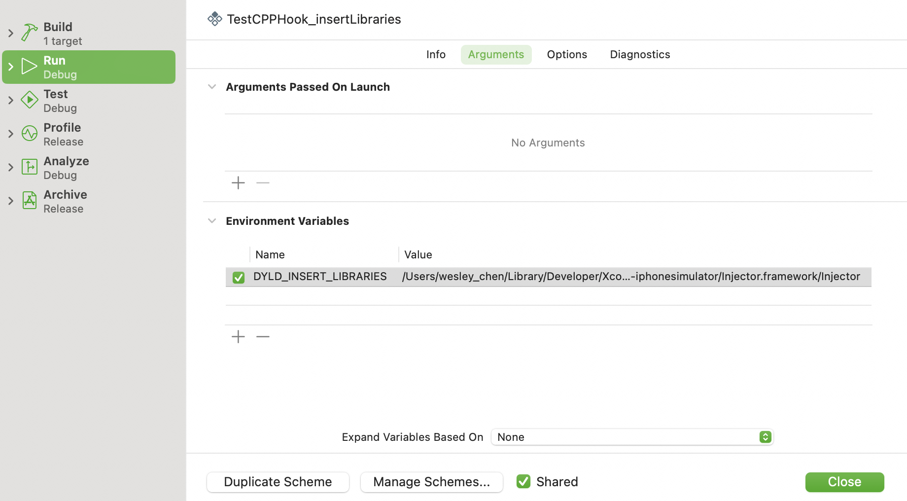

# Learn C++

[TOC]

## 1、前言

本文目录结构参考[cppreference.com](https://en.cppreference.com/)提供的目录[^5]


## 2、Initialization初始化

在C++中初始化值，分为下面几类[^11]

* Default initialization
* Value initialization。例如`std::string s{};`
* Direct initialization。例如`std::string s("hello");`
* Copy initialization。例如`std::string s = "hello";`
* List initialization。例如`std::string s{'a', 'b', 'c'};`
* Aggregate initialization。例如`char a[3] = {'a', 'b'};`
* Reference initialization。例如`char& c = a[0];`

其中C++11开始支持List initialization。

TODO


## 3、类Class

### (1) 静态成员(static member)

#### a. 静态成员不属于类的实例

在类的定义中，使用关键词static声明的成员，并不属于类的实例。

官方文档描述[^12]，如下

> Inside a class definition, the keyword [`static`](dfile:///Users/wesley_chen/Library/Application Support/Dash/DocSets/C++/C++.docset/Contents/Resources/Documents/en.cppreference.com/w/cpp/keyword/static.html) declares members that are not bound to class instances.


#### b. 静态成员的声明和定义

关键词static仅用于声明静态成员，在静态成员的定义中不能使用static关键词。

官方文档描述[^12]，如下

> The static keyword is only used with the declaration of a static member, inside the class definition, but not with the definition of that static member:

举个例子，如下

```c++
class X { public: static int n; }; // declaration (uses 'static')
int X::n = 1;              // definition (does not use 'static')

- (void)test_X {
    std::cout << X::n << std::endl;
}
```


#### c. 静态成员同时需要声明和定义

静态成员在类中声明后，需要对应的定义，不然这个成员属于不完整的类型(incomplete type)。

举个例子，如下

```c++
struct Foo;
 
struct S
{
    static int a[]; // declaration, incomplete type
    static Foo x;   // declaration, incomplete type
    static S s;     // declaration, incomplete type (inside its own definition)
};
 
int S::a[10]; // definition, complete type
struct Foo {};
Foo S::x;     // definition, complete type
S S::s;       // definition, complete type
```


#### d. 访问静态成员

有两种方式可以访问静态成员。假设访问类T的静态成员m

* 使用类和静态成员名，格式`T::m`
* 使用实例，格式`E.m`或者`E->m`。这里E是表达式，可以返回T或T*类型

举个例子，如下

```c++
struct X2
{
    static void f(); // declaration
    static int n;    // declaration
};

X2 g() { return X2(); } // some function returning X2
 
void f()
{
    X2::f();  // X2::f is a qualified name of static member function
    g().f(); // g().f is member access expression referring to a static member function
}
 
int X2::n = 7; // definition
 
void X2::f() // definition
{
    n = 1; // X2::n is accessible as just n in this scope
}

- (void)test_X2 {
    // Case1: static member owned by class
    std::cout << X2::n << std::endl;
    X2::f();
    
    // Case2: static member shared by all objects
    X2 o1;
    std::cout << o1.n << std::endl;
}
```


#### e. 继承父类的静态函数

参考这个SO的回答[^13]，举个例子，如下

```c++
class BaseClass1 {
public:
    static std::string bar() {
        return "bar";
    }
    static std::string foo() {
        return bar();
    }
};

class DerivedClass1: public BaseClass1 {
public:
    static std::string bar() {
        return "baz";
    }
};

- (void)test_static_member_inheritance {    
    // Case1: foo() only in base class, so it always call base class's function
    XCTAssertTrue(DerivedClass1::foo() == string("bar"));
    
    // Case2: bar() both defined in derived and base class, but they are belong to each class
    XCTAssertTrue(BaseClass1::bar() == string("bar"));
    XCTAssertTrue(DerivedClass1::bar() == string("baz"));
}
```

第一个case，由于foo函数在子类没有，使用`DerivedClass1::foo()`会访问到父类的方法

第二个case，由于bar函数在子类和父类都用，根据T::m的T类型调用对应的静态成员函数


### (2) 抽象类(Abstract class)

抽象类(Abstract class)是定义一个不能实例化的类，但是可以作为基类。

官方文档描述[^14]，如下

> Defines an abstract type which cannot be instantiated, but can be used as a base class.

这个描述实际是抽象类的用途。

官方文档对抽象类的定义[^14]，如下

> An *abstract class* is a class that either defines or inherits at least one function for which [the final overrider](dfile:///Users/wesley_chen/Library/Application Support/Dash/DocSets/C++/C++.docset/Contents/Resources/Documents/en.cppreference.com/w/cpp/language/virtual.html) is *pure virtual*.

上面的意思是，类中至少有一个函数，或者继承的函数，是纯虚的(pure virtual)（这个函数也称为纯虚函数），那么这个类是抽象类。

这里首先要介绍纯虚函数的概念。


#### a. 纯虚函数(pure virtual function)

纯虚函数(pure virtual function)，采用下面语法[^14]

```c++
declarator virt-specifier(optional) = 0		
```

这里的`= 0`称为pure描述符(pure-specifier)，它跟着函数声明或者virt-specifier(指的是override或final)的后面。

注意：pure描述符不能出现成员函数定义上，或者友元声明上

> *pure-specifier* cannot appear in a member function definition or [friend](dfile:///Users/wesley_chen/Library/Application Support/Dash/DocSets/C++/C++.docset/Contents/Resources/Documents/en.cppreference.com/w/cpp/language/friend.html) declaration.

举个例子[^14]，如下

```c++
struct Base
{
    virtual int g();
    virtual ~Base() {}
};
 
struct A : Base
{
    // OK: declares three member virtual functions, two of them pure
    virtual int f() = 0, g() override = 0, h();
 
    // OK: destructor can be pure too
    ~A() = 0;
 
    // Error: pure-specifier on a function definition
    virtual int b() = 0 {}
};
```

在上面示例中，类A的`f（）`、`g()`、`~A()`都是纯虚函数，而`h()`只是虚函数，`b()`是定义，不能使用pure描述符。


#### b. 继承抽象类

上面提到抽象类不能被实例化，只能被继承。

举个例子，如下

```c++
struct AbstractClass1
{
    virtual void f() = 0;  // pure virtual
}; // "AbstractClass1" is abstract

struct ConcreteClass1 : AbstractClass1
{
    void f() override {}   // non-pure virtual
    virtual void g() {};      // non-pure virtual
}; // "ConcreteClass1" is non-abstract

struct AbstractClass2 : ConcreteClass1
{
    void g() override = 0; // pure virtual overrider
}; // "AbstractClass2" is abstract

- (void)test_use_abstract_class_type {
    //AbstractClass1 a;   // Error: abstract class
    ConcreteClass1 b;      // OK
    AbstractClass1& a = b; // OK to reference abstract base
    a.f();           // virtual dispatch to Concrete::f()
    //AbstractClass2 a2; // Error: abstract class (final overrider of g() is pure)
}
```

上面AbstractClass1因为有f()是纯虚函数，所以它是抽象类。而ConcreteClass1继承AbstractClass1，但是实现了f()纯虚函数，所以它不是抽象类。AbstractClass2继承自非抽象类，但是它包含纯虚函数g()，所以它是抽象类。

> 示例代码，见Test_abstract_class.mm


#### c. 非inline方式实现纯虚函数

上面ConcreteClass1实现纯虚函数f()是内联方式(inline)，这篇文档[^17]提到在类的定义中，使用和不使用inline关键词是一样的

> In the class declaration, the functions were declared without the **`inline`** keyword. The **`inline`** keyword can be specified in the class declaration; the result is the same.

如果不使用inline方式实现纯虚函数。举个例子，如下

```c++
struct AbstractClass1
{
    virtual void f() = 0;  // pure virtual
    virtual void h() = 0;  // pure virtual
}; // "AbstractClass1" is abstract

struct ConcreteClass1 : AbstractClass1
{
    void f() override {}   // non-pure virtual
    void h() override;   // Note: must re-decalre again for pure virutal function
    virtual void g() {};      // non-pure virtual
}; // "ConcreteClass1" is non-abstract

// ConcreteClass1.cpp
void ConcreteClass1::h()
{
    std::cout << "h() called" << std::endl;
}

- (void)test_none_inline_implement_pure_virtual_function {
    ConcreteClass1 b;
    b.h(); // will print `h() called`
}
```

* 在子类ConcreteClass1的定义中，必须再次声明h()函数。`override`关键词是可选的，在C++11开始支持。
* 在子类ConcreteClass1实现文件(.cpp)中，实现h()函数的定义


## 4、lambda表达式

lambda表达式是指匿名的函数对象，支持在其作用域内捕获变量。

官方文档对lambda表达式描述[^1]，如下

> Constructs a [closure](https://en.wikipedia.org/wiki/Closure_(computer_science)): an unnamed function object capable of capturing variables in scope.

说明

>在C++ 11开始支持lambda表达式


### (1) lambda表达式的签名

官方文档对lambda表达式的签名定义，如下

| 函数签名                                                     | 序号 | C++版本                         |
| ------------------------------------------------------------ | ---- | ------------------------------- |
| [ captures ] ( params ) specs requires(optional) { body }    | (1)  |                                 |
| [ captures ] { body }                                        | (2)  | (until C++23)                   |
| [ captures ] specs { body }                                  | (2)  | (since C++23)                   |
| [ captures ] < tparams > requires(optional) ( params ) specs requires(optional) { body } | (3)  | (since C++20)                   |
| [ captures ] < tparams > requires(optional) { body }         | (4)  | (since C++20)<br/>(until C++23) |
| [ captures ] < tparams > requires(optional) specs { body }   | (4)  | (since C++23)                   |

lambda表达式的签名有很多种，这里只介绍最常用的签名，即(1)类型

```
[ captures ] ( params ) specs requires(optional) { body }
```

参数释义

* captures，捕获变量列表，使用`,`分隔
* params，lambda表达式的参数列表，和一般的函数参数列表是一样的
* specs，描述列表，包含specifiers, exception, attr和trailing-return-type这4种组件，每个组件都是可选的。
  * specifiers，可以是mutable关键词等
  * exception，TODO
  * attr，TODO
  * trailing-return-type，即`-> returnType`格式，表示lambda表达式的返回类型
* requires，TODO
* body，lambda表达式的函数体

了解了上面最常用的lambda表达式的签名，即表格中的(1)类型，可以重新定义下lambda表达式的语法格式，如下

```
[ capture list ] (parameters) -> return-type  
{   
   definition of method   
}
```


### (2) 使用lambda表达式

lambda表达式的用法，有下面几种

* 作为函数的参数
* 定义lambda变量


#### a. 作为函数的参数

在`<algorithm>`中提供很多工具函数，都支持lambda表达式作为参数。

举个例子，如下

```c++
void printVector(std::vector<int> v)
{
    // lambda expression to print vector
    for_each(v.begin(), v.end(), [](int i)
    {
        std::cout << i << " ";
    });
    std::cout << std::endl;
}
```

上面for_each的第三个参数可以是一个lambda表达式，遍历每个元素时，for_each函数内部都会调用lambda表达式。


#### b. 定义lambda变量

使用lambda表达式赋值给C++变量，这个变量就变成lambda变量，可以使用这个变量当成函数调用来使用。

举个例子，如下

```objective-c
- (void)test_named_lambda_expression {
    auto square = [](int i)
    {
        return i * i;
    };
 
    std::cout << "Square of 5 is : " << square(5) << std::endl;
}
```


### (3) lambda表达式的capture列表

上面介绍lambda表达式的签名，提到capture列表，即捕获变量列表。这节详细介绍下capture列表的用法。

capture列表有两种类型的默认捕获(capture-default)，分别使用特定符号`&`和`=`。

* `&`，表示默认按照引用方式，捕获作用域中变量
* `=`，表示默认按照值拷贝方式，捕获作用域中变量

官方文档描述[^1]，如下

> The only capture defaults are
>
> - `&` (implicitly capture the used automatic variables by reference) and
> - `=` (implicitly capture the used automatic variables by copy).


#### a. `&`按引用捕获

capture列表，如果只使用`&`，表示lambda表达式作用域内的变量默认按照引用捕获。

举个例子，如下

```c++
- (void)test_lambda_expression_capture_list_by_reference {
    std::vector<int> v1 = {3, 1, 7, 9};
    std::vector<int> v2 = {10, 2, 7, 16, 9};
 
    //  access v1 and v2 by reference
    auto pushinto = [&] (int m)
    {
        v1.push_back(m);
        v2.push_back(m);
    };
    
    // it pushes 20 in both v1 and v2
    pushinto(20);
    
    printVector(v1);
    printVector(v2);
}
```

由于是按照引用捕获变量v1和v2，则调用push_back函数，可以将原始vector数组添加元素20。


#### b. `=`按值拷贝捕获

capture列表，如果只使用`=`，表示lambda表达式作用域内的变量默认按照值拷贝捕获。

举个例子，如下

```c++
- (void)test_lambda_expression_capture_list_by_copy {
    std::vector<int> v1 = {3, 1, 7, 9};
    std::vector<int> v2 = {10, 2, 7, 16, 9};
 
    //  access v1 and v2 by copy
    auto pushinto = [=] (int m)
    {
        auto v1_copy = v1;
        v1_copy.push_back(m);
        
        // Compile Error: No matching member function for call to 'push_back'
        //v2.push_back(m);
    };
    
    // it pushes 20 in both v1 and v2
    pushinto(20);
    
    printVector(v1);
}
```

上面使用`=`的值拷贝方式，在pushinto表达式中，没有判断出v2的类型，所以识别不了它的成员函数push_back。这里为了演示，采用临时变量v1_copy，用它调用push_back函数。使用printVector打印v1变量，可以看出pushinto(20)没有向原始vector数组v1添加元素20。v1_copy变量确实是v1的一个值拷贝对象。


#### c. 指定变量捕获

在capture列表中指定变量捕获，在官方文档[^1]有下面几种形式：

| 格式                         | 序号 | C++版本       |
| ---------------------------- | ---- | ------------- |
| identifier                   | (1)  |               |
| identifier ...               | (2)  |               |
| identifier initializer       | (3)  | (since C++14) |
| & identifier                 | (4)  |               |
| & identifier ...             | (5)  |               |
| & identifier initializer     | (6)  | (since C++14) |
| this                         | (7)  |               |
| * this                       | (8)  | (since C++17) |
| ... identifier initializer   | (9)  | (since C++20) |
| & ... identifier initializer | (10) | (since C++20) |

每种格式的含义，如下

(1) simple by-copy capture

(2) simple by-copy capture that is a [pack expansion](https://en.cppreference.com/w/cpp/language/parameter_pack)

(3) by-copy capture with an [initializer](https://en.cppreference.com/w/cpp/language/initialization)

(4) simple by-reference capture

(5) simple by-reference capture that is a [pack expansion](https://en.cppreference.com/w/cpp/language/parameter_pack)

(6) by-reference capture with an initializer

(7) simple by-reference capture of the current object

(8) simple by-copy capture of the current object

(9) by-copy capture with an initializer that is a pack expansion

(10) by-reference capture with an initializer that is a pack expansion


这里列举几个常用格式的例子[^4]，如下

```c++
- (void)test_lambda_expression_capture_list_specify_variable {
    
    // Case1
    std::vector<int> v1 = {3, 1, 7, 9};
    // access v1 by copy
    auto printV1 = [v1]()
    {
        for (auto p = v1.begin(); p != v1.end(); p++)
        {
            std::cout << *p << " ";
        }
        
        std::cout << std::endl;
    };
    
    printV1();
    
    // Case2
    int N = 5;
    std::vector<int>::iterator p = find_if(v1.begin(), v1.end(), [N](int i)
    {
        return i > N;
    });
    
    if (p != std::end(v1)) {
        std::cout << "First number greater than 5 is : " << *p << std::endl;
    }
    else {
        std::cout << "First number greater than 5 not found" << std::endl;
    }
    
    // Case3
    auto pushinto = [&v1] (int m)
    {
        v1.push_back(m);
    };
    
    // it pushes 20 in both v1 and v2
    pushinto(20);
    printVector(v1);
}
```


在capture列表中可以定义变量并初始化，举个例子[^1]，如下

```c++
- (void)test_lambda_expression_capture_list_initialize_variable {
    int x = 4;
     
    auto y = [&r = x, x = x + 1]() -> int
    {
        r += 2;
        return x * x;
    }(); // updates ::x to 6 and initializes y to 25.
    
    std::cout << "x: " << x << std::endl;
    std::cout << "y: " << y << std::endl;
}

```

* 上面r变量是x变量的引用，对r变量的修改，等价是修改x变量
* capture列表的第2个变量x，是新的变量，不同于int x=4中x变量，x*x实际是5 * 5，并将值赋值给y


#### d. 没有变量捕获

如果没有变量捕获，则capture列表可以为空。

举个例子，如下

```c++
auto square = [](int i)
{
    return i * i;
};

std::cout << "Square of 5 is : " << square(5) << std::endl;
```


#### e. pack expansion

TODO: https://learn.microsoft.com/en-us/cpp/cpp/lambda-expressions-in-cpp?view=msvc-170


## 5、string库

### (1) std::string

std::string有下面几种初始化方式

* 从const char*初始化

```c++
// Creating a string from const char*     
std::string str1 = "hello";
std::string str2 = std::string("hello");
```

* 字面量初始化

```c++
using namespace std::literals;
auto cppString2 = "中文"s;
std::cout << cppString2 << std::endl;
```

注意

> 字面量字符串带后缀s，并且配合using namespace std::literals;使用，否则auto推断的类型会不准确，导致调用这个变量的方法时，可能会有编译错误。


### (2) String IO

`ostringstream`是`basic_ostringstream<char>`的别名，它定义在`<sstream>`头文件中。作用是存放输出字符串。

举个例子，如下

```c++
- (void)test_std_ostringstream {
    std::ostringstream stream;
    
    stream << "Hello, " << "ostring" << "stream";
    stream << std::endl;
    
    std::string string = stream.str();
    const char* s = string.c_str();
    
    printf("%s", s);
}
```


## 6、algorithm库

algorithm库提供一些常用的工具函数。

导入头文件方式：`#include <algorithm>`


### (1) 常用的工具函数

| 函数名   | 作用                     |
| -------- | ------------------------ |
| for_each | 遍历list容器，例如vector |


#### a. for_each函数

for_each函数的签名如下

| 函数签名                                                     | 序号 | C++版本       |
| ------------------------------------------------------------ | ---- | ------------- |
| template< class InputIt, class UnaryFunction ><br/>UnaryFunction for_each( InputIt first, InputIt last, UnaryFunction f ); | (1)  | (until C++20) |
| template< class InputIt, class UnaryFunction ><br/>constexpr UnaryFunction for_each( InputIt first, InputIt last, UnaryFunction f ); | (1)  | (since C++20) |
| template< class ExecutionPolicy, class ForwardIt, class UnaryFunction2 ><br/>void for_each( ExecutionPolicy&& policy, ForwardIt first, ForwardIt last, UnaryFunction2 f ); | (2)  | (since C++17) |

Xcode的libc++实现，如下

```c++
template <class _InputIterator, class _Function>
inline _LIBCPP_INLINE_VISIBILITY _LIBCPP_CONSTEXPR_AFTER_CXX17 _Function for_each(_InputIterator __first,
                                                                                  _InputIterator __last,
                                                                                  _Function __f) {
  for (; __first != __last; ++__first)
    __f(*__first);
  return __f;
}
```


举个例子，如下

```c++
void printVector(std::vector<int> v)
{
    // lambda expression to print vector
    for_each(v.begin(), v.end(), [](int i)
    {
        std::cout << i << " ";
    });
    std::cout << std::endl;
}
```


## 7、concurrency库

concurrency库是C++提供内置的能力，用于支持threads、atomic operations、mutual exclusion、condition variable等等。

官方文档对concurrency库的描述[^2]，如下

> C++ includes built-in support for threads, atomic operations, mutual exclusion, condition variables, and futures.

说明

> 从C++ 11开始支持concurrency库


### (1) Threads

TODO


### (2) Atomic operations

TODO


### (3) Mutual exclusion

#### a. call_once函数

导入头文件方式：`#include <mutex>`

call_once函数的签名如下

| 函数签名                                                     | 序号 | C++版本       |
| ------------------------------------------------------------ | ---- | ------------- |
| template< class Callable, class... Args ><br/>void call_once( [std::once_flag](http://en.cppreference.com/w/cpp/thread/once_flag)& flag, Callable&& f, Args&&... args ); | (1)  | (since C++11) |

call_once函数的作用是即使来自不同线程同时调用call_once函数，call_once函数也会保证f对象只被调用一次。

官方文档描述[^3]，如下

> Executes the [*Callable*](https://en.cppreference.com/w/cpp/named_req/Callable) object `f` exactly once, even if called concurrently, from several threads.


call_once可以使用lambda表达式作为参数。

举个例子，如下

```c++
std::once_flag flag1;
 
void simple_do_once()
{
    std::call_once(flag1, [](){ std::cout << "Simple example: called once\n"; });
}

- (void)test_call_once_with_lambda_expression {
    std::thread st1(simple_do_once);
    std::thread st2(simple_do_once);
    std::thread st3(simple_do_once);
    std::thread st4(simple_do_once);
    st1.join();
    st2.join();
    st3.join();
    st4.join();
}
```

上面创建4个线程，同时调用simple_do_once函数，但是lambda表达式仅执行一次。


call_once可以使用回调函数作为参数。

举个例子，如下

```c++
std::once_flag flag2;

void may_throw_function(bool do_throw)
{
    if (do_throw) {
        std::cout << "throw: call_once will retry\n"; // this may appear more than once
        throw std::exception();
    }
    std::cout << "Didn't throw, call_once will not attempt again\n"; // guaranteed once
}

void do_once(bool do_throw)
{
    try {
        std::call_once(flag2, may_throw_function, do_throw);
    }
    catch (...) {
    }
}

- (void)test_call_once_with_callback_function {
    std::thread t1(do_once, true); // cause to throw exception
    std::thread t2(do_once, true); // cause to throw exception
    std::thread t3(do_once, false);
    std::thread t4(do_once, true); // cause to throw exception
    t1.join();
    t2.join();
    t3.join();
    t4.join();
}
```

上面创建4个线程，同时调用may_throw_function函数，需要说明的是这个函数可能会抛出异常。

如果在call_once函数的Callable&& f中存在异常抛出，则会导致flag参数，没有正确被设置，那么这次call_once函数调用属于异常情况，下次调用call_once函数，还是进行一次对f参数调用。这种情况下，call_once函数不能保证只调用一次。

在上面有三个异常抛出，可能的输出结果是

```
throw: call_once will retry
throw: call_once will retry
Didn't throw, call_once will not attempt again
```

有两次throw: call_once will retry输出，说明call_once函数保证只调用一次已经失效。在输出Didn't throw, call_once will not attempt again后，call_once函数才生效，后续重复调用call_once函数，则不会调用Callable&& f


说明

> 针对call_once函数可能失效的情况，需要在Callable&& f的内部，使用try-catch提前处理好异常情况，这样保证call_once函数能正常工作。


##### 使用call_once函数创建一个单例

call_once函数的常见用途，就是创建一个单例。举个例子，如下

```c++
class MyClass {
public:
    static MyClass *shared_instance() {
        static MyClass *sharedInstance = nullptr;
        static std::once_flag oc;
        std::call_once(oc, [&] {
            try {
                if (sharedInstance == nullptr) {
                    sharedInstance = new MyClass();
                }
            }
            catch (...) {
            }
        });
        
        return sharedInstance;
    }
};

void get_shared_instance()
{
    auto sharedInstance = MyClass::shared_instance();
    
    // Warning: \n will not correct output when multi-thread
    //std::cout << sharedInstance << std::endl;
    
    std::ostringstream stream;
    stream << sharedInstance << std::endl;
    
    std::string string = stream.str();
    const char* s = string.c_str();
    
    printf("%s", s);
}

- (void)test_call_once_for_shared_instance {
    std::thread st1(get_shared_instance);
    std::thread st2(get_shared_instance);
    std::thread st3(get_shared_instance);
    std::thread st4(get_shared_instance);
    st1.join();
    st2.join();
    st3.join();
    st4.join();
}
```

上面创建4个线程，同时获取单例，由于call_once函数，保证获取都是同一个单例对象，打印的对象地址是相同的。


### (4) Condition variables

TODO


## 8、utilities库

### (1) std::bind

std::bind函数的签名，如下

| 函数签名                                                     | 序号 | C++版本                          |
| ------------------------------------------------------------ | ---- | -------------------------------- |
| template< class F, class... Args ><br/>/\*unspecified\*/ bind( F&& f, Args&&... args ); | (1)  | (since C++11) <br/>(until C++20) |
| template< class F, class... Args ><br/>constexpr */\*unspecified\*/* bind( F&& f, Args&&... args ); | (1)  | (since C++20)                    |
| template< class R, class F, class... Args ><br/>/\*unspecified\*/ bind( F&& f, Args&&... args ); | (2)  | (since C++11) <br/>(until C++20) |
| template< class R, class F, class... Args ><br/>constexpr /\*unspecified\*/ bind( F&& f, Args&&... args ) | (2)  | (since C++20)                    |

定义在`<functional>`头文件中。

std::bind函数的作用是包装已有的函数生成一个函数对象，这个函数对象可以像原始函数那样去调用。

举个简单的例子[^6]，如下

```c++
#include <functional>
#include <iostream>
#include <cassert>

using namespace std;
using namespace std::placeholders;  // for _1, _2, _3...

int add(int first, int second)
{
    printf("first: %d, second: %d\n", first, second);
    return first + second;
}

- (void)test_bind_with_placeholder_parameters {
    // Note: add_func accept two parameters
    auto add_func = std::bind(&add, _1, _2);
    int result = add_func(4, 5);
    std::cout << result << std::endl;
    assert(result == 9);
}
```

std::bind函数的参数，有两部分

* 第一个参数，是Callable对象，例如函数指针等
* 剩余参数，是传递给原始函数的参数，可以是默认值，或者占位变量，例如`_1`、`_2`等

说明

> 1. `_1`、`_2`，定义在std::placeholders命名空间中
> 2. std::bind函数的占位变量的顺序，可以是任意的，这个顺序决定传给原始函数的参数列表


std::bind函数常用的几个用法

* 包装原始函数，方便像闭包一样传递和调用
* 调整调用参数，可以安排参数顺序，设置默认值等
* 配合STL函数使用，很多STL函数支持函数对象


### (2) std::shared_ptr

std::shared_ptr是C++智能指针(Smart Poiner)的一种，它持有对象的拥有权，几个shared_ptr指针可以拥有同一个对象。对象的销毁和内存释放，满足下面两个条件之一：

* 最后持有对象的shared_ptr指针被销毁
* 最后持有对象的shared_ptr指针，通过operator=被重新赋值，或者调用了reset()函数

官方文档的描述[^7]，如下

> `std::shared_ptr` is a smart pointer that retains shared ownership of an object through a pointer. Several `shared_ptr` objects may own the same object. The object is destroyed and its memory deallocated when either of the following happens:
>
> - the last remaining `shared_ptr` owning the object is destroyed;
> - the last remaining `shared_ptr` owning the object is assigned another pointer via [operator=](dfile:///Users/wesley_chen/Library/Application Support/Dash/DocSets/C++/C++.docset/Contents/Resources/Documents/en.cppreference.com/w/cpp/memory/shared_ptr/operator%3D.html) or [reset()](dfile:///Users/wesley_chen/Library/Application Support/Dash/DocSets/C++/C++.docset/Contents/Resources/Documents/en.cppreference.com/w/cpp/memory/shared_ptr/reset.html).


#### a. std::make_shared函数

std::make_shared函数，用于创建std::shared_ptr指针。

std::make_shared的签名，如下

| 函数签名                                                     | 序号 | C++版本                            |
| ------------------------------------------------------------ | ---- | ---------------------------------- |
| template< class T, class... Args ><br/>shared_ptr<T> make_shared( Args&&... args ); | (1)  | (since C++11)<br/>(T is not array) |
| template< class T ><br/>shared_ptr<T> make_shared( [std::size_t](dfile:///Users/wesley_chen/Library/Application Support/Dash/DocSets/C++/C++.docset/Contents/Resources/Documents/en.cppreference.com/w/cpp/types/size_t.html) N ); | (2)  | (since C++20)<br/>(T is U[])       |
| template< class T ><br/>shared_ptr<T> make_shared();         | (3)  | (since C++20)<br/>(T is U[N])      |
| template< class T ><br/>shared_ptr<T> make_shared( [std::size_t](dfile:///Users/wesley_chen/Library/Application Support/Dash/DocSets/C++/C++.docset/Contents/Resources/Documents/en.cppreference.com/w/cpp/types/size_t.html) N, const [std::remove_extent_t](dfile:///Users/wesley_chen/Library/Application Support/Dash/DocSets/C++/C++.docset/Contents/Resources/Documents/en.cppreference.com/w/cpp/types/remove_extent.html)<T>& u ); | (4)  | (since C++20)<br/>(T is U[])       |
| template< class T ><br/>shared_ptr<T> make_shared( const [std::remove_extent_t](dfile:///Users/wesley_chen/Library/Application Support/Dash/DocSets/C++/C++.docset/Contents/Resources/Documents/en.cppreference.com/w/cpp/types/remove_extent.html)<T>& u ); | (5)  | (since C++20)<br/>(T is U[N])      |
| template< class T ><br/>shared_ptr<T> make_shared_for_overwrite(); | (6)  | (since C++20)<br/>(T is not U[])   |
| template< class T ><br/>shared_ptr<T> make_shared_for_overwrite( [std::size_t](dfile:///Users/wesley_chen/Library/Application Support/Dash/DocSets/C++/C++.docset/Contents/Resources/Documents/en.cppreference.com/w/cpp/types/size_t.html) N ); | (7)  | (since C++20)<br/>(T is U[])       |

定义在`<memory>`头文件中。

这里介绍最常见的写法(1)，它从C++11开始支持。


##### 1. 创建shared_ptr指针

创建shared_ptr指针有两种方式

* 使用std::make_shared函数
* 使用shared_ptr的构造函数

举个例子[^10]，如下

```c++
- (void)test_create_shared_ptr {
    // Style1: Use make_shared to create
    std::shared_ptr<int> foo = std::make_shared<int>(10);
    // Style2: Use constructor to create
    std::shared_ptr<int> foo2(new int(10));
    
    std::cout << *foo << std::endl;
    std::cout << *foo2 << std::endl;
}
```

官方文档[^9]不推荐使用构造函数的方式，原因有下面几点

* `std::shared_ptr<T>(new T(args...))`，至少有两次内存分配，对象T和shared_ptr指针的分配。而`std::make_shared<T>`只有一次内存分配
* `std::shared_ptr<T>(new T(args...))`可能会调用非public的构造函数，而`std::make_shared<T>`不会，明确要求是public函数

这里列举了几条，完整参考官方文档[^9]，如下

> This function may be used as an alternative to [std::shared_ptr](https://en.cppreference.com/w/cpp/memory/shared_ptr)<T>(new T(args...)). The trade-offs are:
>
> - [std::shared_ptr](https://en.cppreference.com/w/cpp/memory/shared_ptr)<T>(new T(args...)) performs at least two allocations (one for the object `T` and one for the control block of the shared pointer), while std::make_shared<T> typically performs only one allocation (the standard recommends, but does not require this; all known implementations do this)
> - If any [std::weak_ptr](https://en.cppreference.com/w/cpp/memory/weak_ptr) references the control block created by `std::make_shared` after the lifetime of all shared owners ended, the memory occupied by `T` persists until all weak owners get destroyed as well, which may be undesirable if sizeof(T) is large.
> - [std::shared_ptr](https://en.cppreference.com/w/cpp/memory/shared_ptr)<T>(new T(args...)) may call a non-public constructor of `T` if executed in context where it is accessible, while `std::make_shared` requires public access to the selected constructor.
> - Unlike the [std::shared_ptr](https://en.cppreference.com/w/cpp/memory/shared_ptr) constructors, `std::make_shared` does not allow a custom deleter.
> - `std::make_shared` uses ::new, so if any special behavior has been set up using a class-specific [`operator new`](https://en.cppreference.com/w/cpp/memory/new/operator_new), it will differ from [std::shared_ptr](https://en.cppreference.com/w/cpp/memory/shared_ptr)<T>(new T(args...)).


##### 2. std::make_shared函数返回值使用auto类型

std::make_shared函数类型是std::shared_ptr，但是也可以使用auto类型，让编译器自己推断类型。

举个例子，如下

```c++
- (void)test_make_shared_return_auto_type {
    auto bar = std::make_shared<int>(20);
    std::cout << *bar << std::endl;
}
```


##### 3. std::make_shared函数使用标准库类型

上面例子中`std::shared_ptr<int>`，T是int类型，是基本类型，但实际T也可以标准库类型。

举个例子，如下

```c++
- (void)test_make_shared_with_std_pair {
    auto baz = std::make_shared<std::pair<int,int>>(30, 40);
    std::cout << "*baz: " << baz->first << ' ' << baz->second << std::endl;
}
```

由于baz已经是指向std::pair对象的指针，访问对象的成员变量，不需要再解引用使用，例如`baz->first`


##### 4. std::make_shared函数使用自定义类

官方文档[^10]提供下面的示例代码，如下

```c++
struct C
{
    // constructors needed (until C++20)
    C(int i) : i(i) {}
    C(int i, float f) : i(i), f(f) {}
    int i;
    float f{};
};

- (void)test_make_shared_with_custom_struct {
    // Case 1
    auto sp1 = std::make_shared<C>(1); // overload (1)
    static_assert(std::is_same_v<decltype(sp1), std::shared_ptr<C>>);
    std::cout << "sp1->{ i:" << sp1->i << ", f:" << sp1->f << " }\n";
    
    // Case 2
    std::shared_ptr<C> sp2 = std::make_shared<C>(2, 3.0f); // overload (1)
    static_assert(std::is_same_v<decltype(sp2), std::shared_ptr<C>>);
    std::cout << "sp2->{ i:" << sp2->i << ", f:" << sp2->f << " }\n";
}
```


## 9、C++ Hook

### (1) hook new和delete操作符

在C++中new和delete操作符，实际是定义在`<new>`头文件中C函数，如下

```c++
void* operator new  ( std::size_t count );
void operator delete(void* ptr) noexcept;
```

上面仅示例常用的函数形式，实际变体有很多种。new和delete操作符的函数实现，可以参考官方文档[^8]

说明

> 和普通的C函数命名不一样，上面的C函数符号名是包含空格的，例如new操作符对应的C函数的符号名是`operator new`。在lldb中，使用`image lookup -s`来查询对应的符号信息，如下
>
> ```shell
> (lldb) image lookup -s "operator new"
> 4 symbols match 'operator new' in /Applications/Xcode.app/Contents/Developer/Platforms/iPhoneOS.platform/Library/Developer/CoreSimulator/Profiles/Runtimes/iOS.simruntime/Contents/Resources/RuntimeRoot/usr/lib/libc++abi.dylib:
>         Address: libc++abi.dylib[0x0000000000010e6f] (libc++abi.dylib.__TEXT.__text + 63567)
>         Summary: libc++abi.dylib`operator new(unsigned long, std::align_val_t, std::nothrow_t const&)
>         Address: libc++abi.dylib[0x0000000000010dc5] (libc++abi.dylib.__TEXT.__text + 63397)
>         Summary: libc++abi.dylib`operator new(unsigned long, std::align_val_t)
>         Address: libc++abi.dylib[0x0000000000010d1f] (libc++abi.dylib.__TEXT.__text + 63231)
>         Summary: libc++abi.dylib`operator new(unsigned long, std::nothrow_t const&)
>         Address: libc++abi.dylib[0x0000000000010cc0] (libc++abi.dylib.__TEXT.__text + 63136)
>         Summary: libc++abi.dylib`operator new(unsigned long)
> ```
>
> 上面有4个`operator new`符号，对应4种签名的重载函数，它们都定义在libc++abi.dylib中。
>
> 
>
> 查询delete操作符的实现函数，如下
>
> ```shell
> (lldb) image lookup -s "operator delete"
> 6 symbols match 'operator delete' in /Applications/Xcode.app/Contents/Developer/Platforms/iPhoneOS.platform/Library/Developer/CoreSimulator/Profiles/Runtimes/iOS.simruntime/Contents/Resources/RuntimeRoot/usr/lib/libc++abi.dylib:
>         Address: libc++abi.dylib[0x0000000000010d89] (libc++abi.dylib.__TEXT.__text + 63337)
>         Summary: libc++abi.dylib`operator delete(void*)
>         Address: libc++abi.dylib[0x0000000000010d93] (libc++abi.dylib.__TEXT.__text + 63347)
>         Summary: libc++abi.dylib`operator delete(void*, std::nothrow_t const&)
>         Address: libc++abi.dylib[0x0000000000010ec1] (libc++abi.dylib.__TEXT.__text + 63649)
>         Summary: libc++abi.dylib`operator delete(void*, std::align_val_t)
>         Address: libc++abi.dylib[0x0000000000010ecb] (libc++abi.dylib.__TEXT.__text + 63659)
>         Summary: libc++abi.dylib`operator delete(void*, std::align_val_t, std::nothrow_t const&)
>         Address: libc++abi.dylib[0x0000000000010d9d] (libc++abi.dylib.__TEXT.__text + 63357)
>         Summary: libc++abi.dylib`operator delete(void*, unsigned long)
>         Address: libc++abi.dylib[0x0000000000010ed5] (libc++abi.dylib.__TEXT.__text + 63669)
>         Summary: libc++abi.dylib`operator delete(void*, unsigned long, std::align_val_t)
> ```
>
> 上面有6个`operator delete`符号，对应6种签名的重载函数，它们也都定义在libc++abi.dylib中。


如果要hook代码中new和delete的调用，目前有几种hook形式

* 代码静态链接，即目标代码和hook代码可以编译在同一个可执行文件中
  * 在实际验证中，编译器在链接符号时，总是链接hook代码中自定义重写的C函数
* 代码动态链接，即目标代码在可执行文件中，而hook代码在另外一个动态库中。这种情况适用无法编译目标代码的场景，有两种方式可以插入hook代码
  * hook编译成动态库，链接到可执行文件上。例如在Xcode中设置Link Binary With Libraries指定hook代码所在framework
  * hook编译成动态库，在可执行文件的环境变量设置`DYLD_INSERT_LIBRARIES`，指定hook代码所在framework

说明

> 上面几种hook形式，仅对当前可执行文件或动态库有效。如果是系统动态库，由于编译时已经确定链接的符号，hook会不生效（这点需要验证）

以下面hook代码作为示例，介绍上面三种方式

```c++
void* operator new(std::size_t size) {
    std::cout << "Allocating " << size << " bytes" << std::endl;
    void* ptr = std::malloc(size);
    return ptr;
}

void operator delete(void* ptr) noexcept {
    std::cout << "free " << ptr << std::endl;
    std::free(ptr);
}
```

上面代码参考官方文档提供的例子[^8]

测试代码，如下

```c++
class MyClass {
public:
    MyClass() {
        std::cout << "Constructing MyClass" << std::endl;
    }
    
    ~MyClass() {
        std::cout << "Destructing MyClass" << std::endl;
    }
};

- (void)test {
    std::cout << "Allocating MyClass" << std::endl;
    MyClass* ptr = new MyClass();
    std::cout << "Deleting MyClass" << std::endl;
    delete ptr;
}
```


#### a. 代码静态链接hook

代码静态链接hook，在上面已经提到，是hook代码和目标代码都集成在同一个可执行文件中。不管hook代码和目标代码一起编译，还是作为静态库一起链接，都属于代码静态链接。

示例如下图


> 示例见TestCPPHook_linkStatic target


#### b. 链接动态库hook

链接动态库hook，是指编译可执行文件时，设置依赖的动态库，该动态库包含hook代码。

举个例子，准备好Injector.framewok，然后设置Link Binary With Libraries，如下



> 示例见TestCPPHook_linkDynamic target


#### c. 使用`DYLD_INSERT_LIBRARIES`插入动态库hook

使用`DYLD_INSERT_LIBRARIES`插入动态库hook，适用于只有可执行文件的情况。在Xcode中配置环境变量，如下



其中下面路径

```
/Users/wesley_chen/Library/Developer/Xcode/DerivedData/HelloCPP-dsjwctyhbshyvggefqdemxhdgfbh/Build/Products/Debug-iphonesimulator/Injector.framework/Injector
```

可以在Injector.framework的产物目录找到。如果是真机或者Release编译，这个路径会发生改变，需要重新设置。

> 示例见TestCPPHook_insertLibraries target


## 10、C++编译常见报错

### (1)  "vtable for XXX", referenced from:

示例报错，如下

```
Undefined symbols for architecture x86_64:
  "vtable for Concrete", referenced from:
      Concrete::Concrete() in Test_abstract_class.o
  NOTE: a missing vtable usually means the first non-inline virtual member function has no definition.
ld: symbol(s) not found for architecture x86_64
```

原因是，虚函数没有实现，需要定义[^15]

举个报错的例子[^16]，如下

```c++
class Base
{
public:
  virtual int foo() = 0;
  virtual int bar() = 0;
};

class Derived : public Base
{
public:
  Derived() {}
  ~Derived() {}

  virtual int foo(); // <-- causes this obscure linker error
  virtual int bar() {return 0;}
};
```


## 11、其他TODO

### (1) using

（1）别名

C++11支持using用于别名

[1] https://stackoverflow.com/a/20791007


### (2) R语法

格式：prefix(optional) R "delimiter( raw_characters )delimiter"

[1] https://en.cppreference.com/w/cpp/language/string_literal


ISSUE

https://stackoverflow.com/questions/8112656/objective-c-blocks-and-c-objects


TODO：

依赖的lib：gmock

依赖的头文件：#include <gmock/gmock.h>

下载地址：https://github.com/google/googletest/archive/refs/tags/release-1.11.0.zip

https://chromium.googlesource.com/external/github.com/google/googletest/+/HEAD/docs/reference/mocking.md


比较2个版本号字符串

C++版本：https://www.geeksforgeeks.org/compare-two-version-numbers/


## References

[^1]:https://en.cppreference.com/w/cpp/language/lambda

[^2]:https://en.cppreference.com/w/cpp/thread
[^3]:https://en.cppreference.com/w/cpp/thread/call_once

[^4]:https://www.geeksforgeeks.org/lambda-expression-in-c/

[^5]:https://en.cppreference.com/w/cpp

[^6]:https://thispointer.com/stdbind-tutorial-and-usage-details/

[^7]:https://en.cppreference.com/w/cpp/memory/shared_ptr
[^8]:https://en.cppreference.com/w/cpp/memory/new/operator_new
[^9]:https://en.cppreference.com/w/cpp/memory/shared_ptr/make_shared
[^10]:https://cplusplus.com/reference/memory/make_shared/
[^11]:https://en.cppreference.com/w/cpp/language/initialization

[^12]:https://en.cppreference.com/w/cpp/language/static

[^13]:https://stackoverflow.com/questions/34222703/how-to-override-static-method-of-template-class-in-derived-class
[^14]:https://en.cppreference.com/w/cpp/language/abstract_class
[^15]:https://stackoverflow.com/questions/31861803/a-missing-vtable-usually-means-the-first-non-inline-virtual-member-function-has
[^16]:https://stackoverflow.com/questions/1458180/vtable-for-referenced-from-compile-error-xcode
[^17]:https://learn.microsoft.com/en-us/cpp/cpp/inline-functions-cpp?view=msvc-170
