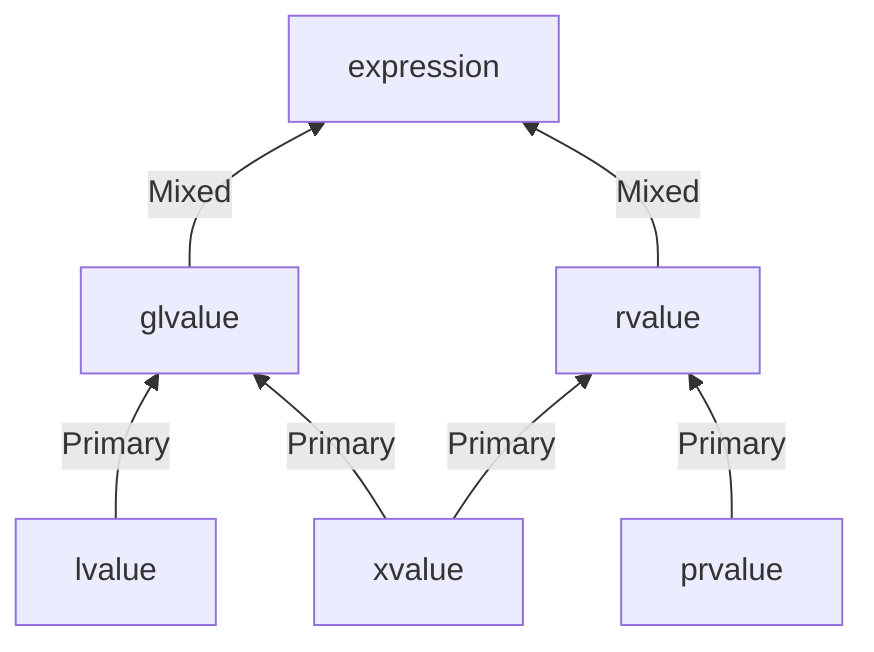
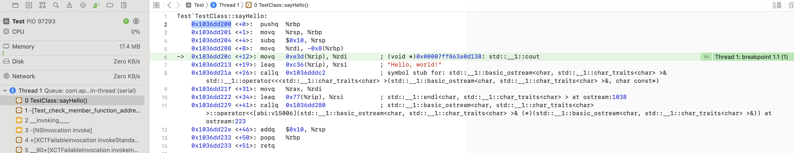

# Learn C++

[TOC]

## 1、前言

本文目录结构，前面部分参考[cppreference.com](https://en.cppreference.com/)提供的目录[^5]，分为下面几大部分

* 基本概念(Basic concepts)
* 关键词(Keywords)
* 预处理器(Preprocessor)
* 表达式(Expression)
* 声明(Declarations)
* 初始化(Initialization)
* 函数(Functions)
* 语句(Statements)
* 类(Classes)
* 模板(Templates)
* 异常(Exception)

说明

> 由于内容不多，本文省略Miscellaneous和Idioms部分，可以自行去看官方文档


## 2、基本概念(Basic concepts)


## 3、关键词(Keywords)

官方文档[^19]给出全部C++关键词(keywords)，如下

| keywords                 | 作用 |
| ------------------------ | ---- |
|                          |      |
|                          |      |
|                          |      |
|                          |      |
| reflexpr (reflection TS) |      |
| register (2)             |      |
| reinterpret_cast         |      |
| requires (C++20)         |      |
| return                   |      |
| short                    |      |
| signed                   |      |
| sizeof (1)               |      |
| static                   |      |
| static_assert (C++11)    |      |
| static_cast              |      |
| struct (1)               |      |
| switch                   |      |
| synchronized (TM TS)     |      |
| template                 |      |
| this (4)                 |      |
| thread_local (C++11)     |      |
| throw                    |      |
| true                     |      |
| try                      |      |
| typedef                  |      |
| typeid                   |      |
| typename                 |      |
| union                    |      |
| unsigned                 |      |
| using (1)                |      |
| virtual                  |      |
| void                     |      |
| volatile                 |      |
| wchar_t                  |      |
| while                    |      |
| xor                      |      |
| xor_eq                   |      |

- (1) — meaning changed or new meaning added in C++11.
- (2) — meaning changed in C++17.
- (3) — meaning changed in C++20.
- (4) — new meaning added in C++23.


### (1) typeid

`typeid`关键词，用于操作符，它的作用是查询类型的信息。

语法格式，如下

| 语法格式                   | 序号 |
| -------------------------- | ---- |
| **typeid** ( *type*)       | (1)  |
| **typeid** ( *expression*) | (2)  |

说明

> type和expression是class类型或者class类型的引用，那么它不能是[incomplete type](dfile:///Users/wesley_chen/Library/Application Support/Dash/DocSets/C++/C++.docset/Contents/Resources/Documents/en.cppreference.com/w/cpp/language/type%23Incomplete_type.html)类型

头文件:  `<typeinfo>`

typeid的返回值是`std::type_info`类型，定义在 `<typeinfo>`中。


### (2) using

`using`在C++11上有新的语法。

官方文档的描述[^20]，如下

> - [using-directives ](dfile:///Users/wesley_chen/Library/Application Support/Dash/DocSets/C++/C++.docset/Contents/Resources/Documents/en.cppreference.com/w/cpp/language/namespace.html#Using-directives)for namespaces and [using-declarations](dfile:///Users/wesley_chen/Library/Application Support/Dash/DocSets/C++/C++.docset/Contents/Resources/Documents/en.cppreference.com/w/cpp/language/namespace.html) for namespace members
> - [using-declarations ](dfile:///Users/wesley_chen/Library/Application Support/Dash/DocSets/C++/C++.docset/Contents/Resources/Documents/en.cppreference.com/w/cpp/language/using_declaration.html)for class members
> - [using-enum-declarations ](dfile:///Users/wesley_chen/Library/Application Support/Dash/DocSets/C++/C++.docset/Contents/Resources/Documents/en.cppreference.com/w/cpp/language/enum.html#Using-enum-declaration)for enumerators (since C++20)
> - [type alias and alias template declaration](dfile:///Users/wesley_chen/Library/Application Support/Dash/DocSets/C++/C++.docset/Contents/Resources/Documents/en.cppreference.com/w/cpp/language/type_alias.html) (since C++11)


## 4、预处理器(Preprocessor)


## 5、表达式(Expression)

### (1) lambda表达式

lambda表达式是指匿名的函数对象，支持在其作用域内捕获变量。

官方文档对lambda表达式描述[^1]，如下

> Constructs a [closure](https://en.wikipedia.org/wiki/Closure_(computer_science)): an unnamed function object capable of capturing variables in scope.

说明

>在C++ 11开始支持lambda表达式


#### a. lambda表达式的签名

官方文档对lambda表达式的签名定义，如下

| 函数签名                                                     | 序号 | C++版本                         |
| ------------------------------------------------------------ | ---- | ------------------------------- |
| [ captures ] ( params ) specs requires(optional) { body }    | (1)  |                                 |
| [ captures ] { body }                                        | (2)  | (until C++23)                   |
| [ captures ] specs { body }                                  | (2)  | (since C++23)                   |
| [ captures ] < tparams > requires(optional) ( params ) specs requires(optional) { body } | (3)  | (since C++20)                   |
| [ captures ] < tparams > requires(optional) { body }         | (4)  | (since C++20)<br/>(until C++23) |
| [ captures ] < tparams > requires(optional) specs { body }   | (4)  | (since C++23)                   |

lambda表达式的签名有很多种，这里只介绍最常用的签名，即(1)类型

```
[ captures ] ( params ) specs requires(optional) { body }
```

参数释义

* captures，捕获变量列表，使用`,`分隔
* params，lambda表达式的参数列表，和一般的函数参数列表是一样的
* specs，描述列表，包含specifiers, exception, attr和trailing-return-type这4种组件，每个组件都是可选的。
  * specifiers，可以是mutable关键词等
  * exception，TODO
  * attr，TODO
  * trailing-return-type，即`-> returnType`格式，表示lambda表达式的返回类型
* requires，TODO
* body，lambda表达式的函数体

了解了上面最常用的lambda表达式的签名，即表格中的(1)类型，可以重新定义下lambda表达式的语法格式，如下

```
[ capture list ] (parameters) -> return-type  
{   
   definition of method   
}
```


#### b. 使用lambda表达式

lambda表达式的用法，有下面几种

* 作为函数的参数
* 定义lambda变量


##### 作为函数的参数

在`<algorithm>`中提供很多工具函数，都支持lambda表达式作为参数。

举个例子，如下

```c++
void printVector(std::vector<int> v)
{
    // lambda expression to print vector
    for_each(v.begin(), v.end(), [](int i)
    {
        std::cout << i << " ";
    });
    std::cout << std::endl;
}
```

上面for_each的第三个参数可以是一个lambda表达式，遍历每个元素时，for_each函数内部都会调用lambda表达式。


##### 定义lambda变量

使用lambda表达式赋值给C++变量，这个变量就变成lambda变量，可以使用这个变量当成函数调用来使用。

举个例子，如下

```objective-c
- (void)test_named_lambda_expression {
    auto square = [](int i)
    {
        return i * i;
    };
 
    std::cout << "Square of 5 is : " << square(5) << std::endl;
}
```


#### c. lambda表达式的capture列表

上面介绍lambda表达式的签名，提到capture列表，即捕获变量列表。这节详细介绍下capture列表的用法。

capture列表有两种类型的默认捕获(capture-default)，分别使用特定符号`&`和`=`。

* `&`，表示默认按照引用方式，捕获作用域中变量
* `=`，表示默认按照值拷贝方式，捕获作用域中变量

官方文档描述[^1]，如下

> The only capture defaults are
>
> - `&` (implicitly capture the used automatic variables by reference) and
> - `=` (implicitly capture the used automatic variables by copy).


#####  `&`按引用捕获

capture列表，如果只使用`&`，表示lambda表达式作用域内的变量默认按照引用捕获。

举个例子，如下

```c++
- (void)test_lambda_expression_capture_list_by_reference {
    std::vector<int> v1 = {3, 1, 7, 9};
    std::vector<int> v2 = {10, 2, 7, 16, 9};
 
    //  access v1 and v2 by reference
    auto pushinto = [&] (int m)
    {
        v1.push_back(m);
        v2.push_back(m);
    };
    
    // it pushes 20 in both v1 and v2
    pushinto(20);
    
    printVector(v1);
    printVector(v2);
}
```

由于是按照引用捕获变量v1和v2，则调用push_back函数，可以将原始vector数组添加元素20。


##### `=`按值拷贝捕获

capture列表，如果只使用`=`，表示lambda表达式作用域内的变量默认按照值拷贝捕获。

举个例子，如下

```c++
- (void)test_lambda_expression_capture_list_by_copy {
    std::vector<int> v1 = {3, 1, 7, 9};
    std::vector<int> v2 = {10, 2, 7, 16, 9};
 
    //  access v1 and v2 by copy
    auto pushinto = [=] (int m)
    {
        auto v1_copy = v1;
        v1_copy.push_back(m);
        
        // Compile Error: No matching member function for call to 'push_back'
        //v2.push_back(m);
    };
    
    // it pushes 20 in both v1 and v2
    pushinto(20);
    
    printVector(v1);
}
```

上面使用`=`的值拷贝方式，在pushinto表达式中，没有判断出v2的类型，所以识别不了它的成员函数push_back。这里为了演示，采用临时变量v1_copy，用它调用push_back函数。使用printVector打印v1变量，可以看出pushinto(20)没有向原始vector数组v1添加元素20。v1_copy变量确实是v1的一个值拷贝对象。


##### 指定变量捕获

在capture列表中指定变量捕获，在官方文档[^1]有下面几种形式：

| 格式                         | 序号 | C++版本       |
| ---------------------------- | ---- | ------------- |
| identifier                   | (1)  |               |
| identifier ...               | (2)  |               |
| identifier initializer       | (3)  | (since C++14) |
| & identifier                 | (4)  |               |
| & identifier ...             | (5)  |               |
| & identifier initializer     | (6)  | (since C++14) |
| this                         | (7)  |               |
| * this                       | (8)  | (since C++17) |
| ... identifier initializer   | (9)  | (since C++20) |
| & ... identifier initializer | (10) | (since C++20) |

每种格式的含义，如下

(1) simple by-copy capture

(2) simple by-copy capture that is a [pack expansion](https://en.cppreference.com/w/cpp/language/parameter_pack)

(3) by-copy capture with an [initializer](https://en.cppreference.com/w/cpp/language/initialization)

(4) simple by-reference capture

(5) simple by-reference capture that is a [pack expansion](https://en.cppreference.com/w/cpp/language/parameter_pack)

(6) by-reference capture with an initializer

(7) simple by-reference capture of the current object

(8) simple by-copy capture of the current object

(9) by-copy capture with an initializer that is a pack expansion

(10) by-reference capture with an initializer that is a pack expansion


这里列举几个常用格式的例子[^4]，如下

```c++
- (void)test_lambda_expression_capture_list_specify_variable {
    
    // Case1
    std::vector<int> v1 = {3, 1, 7, 9};
    // access v1 by copy
    auto printV1 = [v1]()
    {
        for (auto p = v1.begin(); p != v1.end(); p++)
        {
            std::cout << *p << " ";
        }
        
        std::cout << std::endl;
    };
    
    printV1();
    
    // Case2
    int N = 5;
    std::vector<int>::iterator p = find_if(v1.begin(), v1.end(), [N](int i)
    {
        return i > N;
    });
    
    if (p != std::end(v1)) {
        std::cout << "First number greater than 5 is : " << *p << std::endl;
    }
    else {
        std::cout << "First number greater than 5 not found" << std::endl;
    }
    
    // Case3
    auto pushinto = [&v1] (int m)
    {
        v1.push_back(m);
    };
    
    // it pushes 20 in both v1 and v2
    pushinto(20);
    printVector(v1);
}
```


在capture列表中可以定义变量并初始化，举个例子[^1]，如下

```c++
- (void)test_lambda_expression_capture_list_initialize_variable {
    int x = 4;
     
    auto y = [&r = x, x = x + 1]() -> int
    {
        r += 2;
        return x * x;
    }(); // updates ::x to 6 and initializes y to 25.
    
    std::cout << "x: " << x << std::endl;
    std::cout << "y: " << y << std::endl;
}

```

* 上面r变量是x变量的引用，对r变量的修改，等价是修改x变量
* capture列表的第2个变量x，是新的变量，不同于int x=4中x变量，x*x实际是5 * 5，并将值赋值给y


##### 没有变量捕获

如果没有变量捕获，则capture列表可以为空。

举个例子，如下

```c++
auto square = [](int i)
{
    return i * i;
};

std::cout << "Square of 5 is : " << square(5) << std::endl;
```


##### pack expansion

TODO: https://learn.microsoft.com/en-us/cpp/cpp/lambda-expressions-in-cpp?view=msvc-170


### (2) 字符串字面量(String literal)

C++的字符串字面量(String literal)，有多种语法格式，官方文档[^21]提供格式，如下

| 语法格式                                                     | 序号 | C++版本       |
| ------------------------------------------------------------ | ---- | ------------- |
| "*s-char-sequence* (optional)"                               | (1)  |               |
| L"*s-char-sequence* (optional)"                              | (2)  |               |
| u8"*s-char-sequence* (optional)"                             | (3)  | (since C++11) |
| u"*s-char-sequence* (optional)"`                             | (4)  | (since C++11) |
| U"*s-char-sequence* (optional)"                              | (5)  | (since C++11) |
| *prefix* (optional) R"*d-char-sequence* (optional)(*r-char-sequence* (optional))*d-char-sequence* (optional)" | (6)  | (since C++11) |


### (3) 值类别(Value categories)

每个C++表达式（一个操作符和它的操作数、字面量、变量名等），有两个独立的属性：类型（type）和值类别（value category）。

每个表达式属于下面三种基本类别中的一种类别（或者也称分类）

* prvalue (“pure” rvalue)
* xvalue (an “eXpiring” value)
* lvalue

说明

> 由于value category的翻译缘故，下文有时候称为值分类，它和值类别是一样的意思

官方文档描述[^23]，如下

> Each C++ [expression](dfile:///Users/wesley_chen/Library/Application Support/Dash/DocSets/C++/C++.docset/Contents/Resources/Documents/en.cppreference.com/w/cpp/language/expressions.html) (an operator with its operands, a literal, a variable name, etc.) is characterized by two independent properties: a *[type](dfile:///Users/wesley_chen/Library/Application Support/Dash/DocSets/C++/C++.docset/Contents/Resources/Documents/en.cppreference.com/w/cpp/language/type.html)* and a *value category*. Each expression has some non-reference type, and each expression belongs to exactly one of the three primary value categories: *prvalue*, *xvalue*, and *lvalue*.

关于完整的值类别的构成图，可以参考下图



这个图来自这篇文章[^25]的图片，按照构成的思路，只是箭头的方向不一样。

根据上面图的构成，可以看出

有三种基本类别(Primary categories)，上面也提到过，这里再赘述下

* prvalue (“pure” rvalue)
* xvalue (an “eXpiring” value)
* lvalue

由上面三种类别构成的有两种混合类别(Mixed categories)，如下

* glvalue (“generalized” lvalue)
* rvalue

每个C++表达式按照分类，即属于两种混合类别(Mixed categories)之一，也属于三种基本类别(Primary categories)之一。

初次理解上面这个值类别的构成图，有点难理解，SO[^26]上也有人提问：

在C++03标准上，表达式属于rvalue或者lvalue

而在C++11标准上，新增了分类，扩大成上面这个值类别构成图，有5种值类别

* prvalue (“pure” rvalue)
* xvalue (an “eXpiring” value)
* lvalue
* glvalue (“generalized” lvalue)
* rvalue

其中lvalue和rvalue还是保留C++03标准中的概念。

官方文档对这5种值类别的定义[^23]，如下

> - a glvalue (“generalized” lvalue) is an expression whose evaluation determines the identity of an object or function;
>
> - a prvalue (“pure” rvalue) is an expression whose evaluation
>
>   - computes the value of an operand of a built-in operator (such prvalue has no *result object*), or
>
>   - initializes an object (such prvalue is said to have a *result object*).
>
>     The result object may be a variable, an object created by new-expression, a temporary created by temporary materialization, or a member thereof. Note that non-void discarded expressions have a result object (the materialized temporary). Also, every class and array prvalue has a result object except when it is the operand of decltype;
>
> - an xvalue (an “eXpiring” value) is a glvalue that denotes an object whose resources can be reused;
> - an lvalue (so-called, historically, because lvalues could appear on the left-hand side of an assignment expression) is a glvalue that is not an xvalue;
> - an rvalue (so-called, historically, because rvalues could appear on the right-hand side of an assignment expression) is a prvalue or an xvalue.

这里将上面这段文档，按照自己的理解释义一下，不一定完全正确。

由于三种基本类别(Primary categories)是原子的，混合类别(Mixed categories)都是被构成的，这里先释义三种基本类别(Primary categories)。

* prvalue (“pure” rvalue)，纯右值类别，这个类别指的表达式属于下面两种情况

  * 表达式使用内置操作符计算操作数的值，称prvalue没有结果对象。举个例子，`int i = 1 + 2;`，其中`1 + 2`是表达式。
  * 表达式用于初始化一个对象，称prvalue有结果对象。举个例子，`int i = 1;`，其中`1`是表达式。

  这里的结果对象(result object)，是指new表达式创建的对象、临时实体化的临时对象、成员访问的临时对象

* xvalue (an “eXpiring” value)，是指对象持有资源是可以被重用的。举个例子，表达式`std::move("hello")`属于xvalue，因为它求值后的对象是可以被重用的。

* lvalue(历史缘故，称为左值)。现在含义是属于glvalue，但是要除去xvalue。举个例子，`int i = 1 + 2;`，其中`i`是表达式，属于lvaue。

* glvalue是广义上lvalue，表达式求值能确定对象和函数的标识，这里的标识(identity)，也可以理解为有标识符的表达式。
* rvalue(历史缘故，称为右值)。现在含义是属于prvalue或xvalue。


#### a. 基本类别(Primary categories)

这篇文章[^25]提供一种方法让编译器来测试表达式属于哪一种基本类别(Primary categories)。

定义下面宏，如下

```c++
template<typename T> constexpr const char *category = "prvalue";
template<typename T> constexpr const char *category<T&> = "lvalue";
template<typename T> constexpr const char *category<T&&> = "xvalue";

#define SHOW(E) std::cout << #E << ": " << category<decltype((E))> << std::endl
```


##### lvalue表达式

官方文档[^23]，如下

> The following expressions are *lvalue expressions*:
>
> - the name of a variable, a function, a [template parameter object](dfile:///Users/wesley_chen/Library/Application Support/Dash/DocSets/C++/C++.docset/Contents/Resources/Documents/en.cppreference.com/w/cpp/language/template_parameters.html#Non-type_template_parameter) (since C++20), or a data member, regardless of type, such as [std::cin](dfile:///Users/wesley_chen/Library/Application Support/Dash/DocSets/C++/C++.docset/Contents/Resources/Documents/en.cppreference.com/w/cpp/io/cin.html) or [std::endl](dfile:///Users/wesley_chen/Library/Application Support/Dash/DocSets/C++/C++.docset/Contents/Resources/Documents/en.cppreference.com/w/cpp/io/manip/endl.html). Even if the variable's type is rvalue reference, the expression consisting of its name is an lvalue expression (but see [Move-eligible expressions](dfile:///Users/wesley_chen/Library/Application Support/Dash/DocSets/C++/C++.docset/Contents/Resources/Documents/en.cppreference.com/w/cpp/language/value_category.html#Move-eligible_expressions));
> - a function call or an overloaded operator expression, whose return type is lvalue reference, such as [std::getline](dfile:///Users/wesley_chen/Library/Application Support/Dash/DocSets/C++/C++.docset/Contents/Resources/Documents/en.cppreference.com/w/cpp/string/basic_string/getline.html)([std::cin](dfile:///Users/wesley_chen/Library/Application Support/Dash/DocSets/C++/C++.docset/Contents/Resources/Documents/en.cppreference.com/w/cpp/io/cin.html), str), [std::cout](dfile:///Users/wesley_chen/Library/Application Support/Dash/DocSets/C++/C++.docset/Contents/Resources/Documents/en.cppreference.com/w/cpp/io/cout.html) << 1, str1 = str2, or ++it;
> - a = b, a += b, a %= b, and all other built-in [assignment and compound assignment](dfile:///Users/wesley_chen/Library/Application Support/Dash/DocSets/C++/C++.docset/Contents/Resources/Documents/en.cppreference.com/w/cpp/language/operator_assignment.html) expressions;
> - ++a and --a, the built-in [pre-increment and pre-decrement](dfile:///Users/wesley_chen/Library/Application Support/Dash/DocSets/C++/C++.docset/Contents/Resources/Documents/en.cppreference.com/w/cpp/language/operator_incdec.html#Built-in_prefix_operators) expressions;
> - *p, the built-in [indirection](dfile:///Users/wesley_chen/Library/Application Support/Dash/DocSets/C++/C++.docset/Contents/Resources/Documents/en.cppreference.com/w/cpp/language/operator_member_access.html#Built-in_indirection_operator) expression;
> - a[n] and p[n], the built-in [subscript](dfile:///Users/wesley_chen/Library/Application Support/Dash/DocSets/C++/C++.docset/Contents/Resources/Documents/en.cppreference.com/w/cpp/language/operator_member_access.html#Built-in_subscript_operator) expressions, where one operand in a[n] is an array lvalue (since C++11);
> - a.m, the [member of object](dfile:///Users/wesley_chen/Library/Application Support/Dash/DocSets/C++/C++.docset/Contents/Resources/Documents/en.cppreference.com/w/cpp/language/operator_member_access.html#Built-in_member_access_operators) expression, except where `m` is a member enumerator or a non-static member function, or where a is an rvalue and `m` is a non-static data member of object type;
> - p->m, the built-in [member of pointer](dfile:///Users/wesley_chen/Library/Application Support/Dash/DocSets/C++/C++.docset/Contents/Resources/Documents/en.cppreference.com/w/cpp/language/operator_member_access.html#Built-in_member_access_operators) expression, except where `m` is a member enumerator or a non-static member function;
> - a.*mp, the [pointer to member of object](dfile:///Users/wesley_chen/Library/Application Support/Dash/DocSets/C++/C++.docset/Contents/Resources/Documents/en.cppreference.com/w/cpp/language/operator_member_access.html#Built-in_pointer-to-member_access_operators) expression, where a is an lvalue and `mp` is a pointer to data member;
> - p->*mp, the built-in [pointer to member of pointer](dfile:///Users/wesley_chen/Library/Application Support/Dash/DocSets/C++/C++.docset/Contents/Resources/Documents/en.cppreference.com/w/cpp/language/operator_member_access.html#Built-in_pointer-to-member_access_operators) expression, where `mp` is a pointer to data member;
> - a, b, the built-in [comma](dfile:///Users/wesley_chen/Library/Application Support/Dash/DocSets/C++/C++.docset/Contents/Resources/Documents/en.cppreference.com/w/cpp/language/operator_other.html#Built-in_comma_operator) expression, where b is an lvalue;
> - a ? b : c, the [ternary conditional](dfile:///Users/wesley_chen/Library/Application Support/Dash/DocSets/C++/C++.docset/Contents/Resources/Documents/en.cppreference.com/w/cpp/language/operator_other.html#Conditional_operator) expression for certain b and c (e.g., when both are lvalues of the same type, but see [definition](dfile:///Users/wesley_chen/Library/Application Support/Dash/DocSets/C++/C++.docset/Contents/Resources/Documents/en.cppreference.com/w/cpp/language/operator_other.html#Conditional_operator) for detail);
> - a [string literal](dfile:///Users/wesley_chen/Library/Application Support/Dash/DocSets/C++/C++.docset/Contents/Resources/Documents/en.cppreference.com/w/cpp/language/string_literal.html), such as "Hello, world!";
> - a cast expression to lvalue reference type, such as static_cast<int&>(x) or static_cast<void(&)(int)>(x);
> - a non-type [template parameter](dfile:///Users/wesley_chen/Library/Application Support/Dash/DocSets/C++/C++.docset/Contents/Resources/Documents/en.cppreference.com/w/cpp/language/template_parameters.html) of an lvalue reference type;
> - a function call or an overloaded operator expression, whose return type is rvalue reference to function; (since C++11)
> - a cast expression to rvalue reference to function type, such as static_cast<void(&&)(int)>(x). (since C++11)
>
> Properties:
>
> - Same as glvalue (below).
> - Address of an lvalue may be taken by built-in address-of operator: &++i[[1\]](dfile:///Users/wesley_chen/Library/Application Support/Dash/DocSets/C++/C++.docset/Contents/Resources/Documents/en.cppreference.com/w/cpp/language/value_category.html#cite_note-1) and &[std::endl](dfile:///Users/wesley_chen/Library/Application Support/Dash/DocSets/C++/C++.docset/Contents/Resources/Documents/en.cppreference.com/w/cpp/io/manip/endl.html) are valid expressions.
> - A modifiable lvalue may be used as the left-hand operand of the built-in assignment and compound assignment operators.
> - An lvalue may be used to [initialize an lvalue reference](dfile:///Users/wesley_chen/Library/Application Support/Dash/DocSets/C++/C++.docset/Contents/Resources/Documents/en.cppreference.com/w/cpp/language/reference_initialization.html); this associates a new name with the object identified by the expression.


##### prvalue表达式

官方文档[^23]，如下

> The following expressions are *prvalue expressions*:
>
> - a [literal](dfile:///Users/wesley_chen/Library/Application Support/Dash/DocSets/C++/C++.docset/Contents/Resources/Documents/en.cppreference.com/w/cpp/language/expressions.html#Literals) (except for [string literal](dfile:///Users/wesley_chen/Library/Application Support/Dash/DocSets/C++/C++.docset/Contents/Resources/Documents/en.cppreference.com/w/cpp/language/string_literal.html)), such as 42, true or nullptr;
> - a function call or an overloaded operator expression, whose return type is non-reference, such as str.substr(1, 2), str1 + str2, or it++;
> - a++ and a--, the built-in [post-increment and post-decrement](dfile:///Users/wesley_chen/Library/Application Support/Dash/DocSets/C++/C++.docset/Contents/Resources/Documents/en.cppreference.com/w/cpp/language/operator_incdec.html#Built-in_postfix_operators) expressions;
> - a + b, a % b, a & b, a << b, and all other built-in [arithmetic](dfile:///Users/wesley_chen/Library/Application Support/Dash/DocSets/C++/C++.docset/Contents/Resources/Documents/en.cppreference.com/w/cpp/language/operator_arithmetic.html) expressions;
> - a && b, a || b, !a, the built-in [logical](dfile:///Users/wesley_chen/Library/Application Support/Dash/DocSets/C++/C++.docset/Contents/Resources/Documents/en.cppreference.com/w/cpp/language/operator_logical.html) expressions;
> - a < b, a == b, a >= b, and all other built-in [comparison](dfile:///Users/wesley_chen/Library/Application Support/Dash/DocSets/C++/C++.docset/Contents/Resources/Documents/en.cppreference.com/w/cpp/language/operator_comparison.html) expressions;
> - &a, the built-in [address-of](dfile:///Users/wesley_chen/Library/Application Support/Dash/DocSets/C++/C++.docset/Contents/Resources/Documents/en.cppreference.com/w/cpp/language/operator_member_access.html#Built-in_address-of_operator) expression;
> - a.m, the [member of object](dfile:///Users/wesley_chen/Library/Application Support/Dash/DocSets/C++/C++.docset/Contents/Resources/Documents/en.cppreference.com/w/cpp/language/operator_member_access.html#Built-in_member_access_operators) expression, where `m` is a member enumerator or a non-static member function[[2\]](dfile:///Users/wesley_chen/Library/Application Support/Dash/DocSets/C++/C++.docset/Contents/Resources/Documents/en.cppreference.com/w/cpp/language/value_category.html#cite_note-pmfc-2);
> - p->m, the built-in [member of pointer](dfile:///Users/wesley_chen/Library/Application Support/Dash/DocSets/C++/C++.docset/Contents/Resources/Documents/en.cppreference.com/w/cpp/language/operator_member_access.html#Built-in_member_access_operators) expression, where `m` is a member enumerator or a non-static member function[[2\]](dfile:///Users/wesley_chen/Library/Application Support/Dash/DocSets/C++/C++.docset/Contents/Resources/Documents/en.cppreference.com/w/cpp/language/value_category.html#cite_note-pmfc-2);
> - a.*mp, the [pointer to member of object](dfile:///Users/wesley_chen/Library/Application Support/Dash/DocSets/C++/C++.docset/Contents/Resources/Documents/en.cppreference.com/w/cpp/language/operator_member_access.html#Built-in_pointer-to-member_access_operators) expression, where `mp` is a pointer to member function[[2\]](dfile:///Users/wesley_chen/Library/Application Support/Dash/DocSets/C++/C++.docset/Contents/Resources/Documents/en.cppreference.com/w/cpp/language/value_category.html#cite_note-pmfc-2);
> - p->*mp, the built-in [pointer to member of pointer](dfile:///Users/wesley_chen/Library/Application Support/Dash/DocSets/C++/C++.docset/Contents/Resources/Documents/en.cppreference.com/w/cpp/language/operator_member_access.html#Built-in_pointer-to-member_access_operators) expression, where `mp` is a pointer to member function[[2\]](dfile:///Users/wesley_chen/Library/Application Support/Dash/DocSets/C++/C++.docset/Contents/Resources/Documents/en.cppreference.com/w/cpp/language/value_category.html#cite_note-pmfc-2);
> - a, b, the built-in [comma](dfile:///Users/wesley_chen/Library/Application Support/Dash/DocSets/C++/C++.docset/Contents/Resources/Documents/en.cppreference.com/w/cpp/language/operator_other.html#Built-in_comma_operator) expression, where b is an rvalue;
> - a ? b : c, the [ternary conditional](dfile:///Users/wesley_chen/Library/Application Support/Dash/DocSets/C++/C++.docset/Contents/Resources/Documents/en.cppreference.com/w/cpp/language/operator_other.html#Conditional_operator) expression for certain b and c (see [definition](dfile:///Users/wesley_chen/Library/Application Support/Dash/DocSets/C++/C++.docset/Contents/Resources/Documents/en.cppreference.com/w/cpp/language/operator_other.html#Conditional_operator) for detail);
> - a cast expression to non-reference type, such as static_cast<double>(x), [std::string](dfile:///Users/wesley_chen/Library/Application Support/Dash/DocSets/C++/C++.docset/Contents/Resources/Documents/en.cppreference.com/w/cpp/string/basic_string.html){}, or (int)42;
> - the [`this`](dfile:///Users/wesley_chen/Library/Application Support/Dash/DocSets/C++/C++.docset/Contents/Resources/Documents/en.cppreference.com/w/cpp/language/this.html) pointer;
> - an [enumerator](dfile:///Users/wesley_chen/Library/Application Support/Dash/DocSets/C++/C++.docset/Contents/Resources/Documents/en.cppreference.com/w/cpp/language/enum.html);
> - a non-type [template parameter](dfile:///Users/wesley_chen/Library/Application Support/Dash/DocSets/C++/C++.docset/Contents/Resources/Documents/en.cppreference.com/w/cpp/language/template_parameters.html) of a scalar type;
> - a [lambda expression](dfile:///Users/wesley_chen/Library/Application Support/Dash/DocSets/C++/C++.docset/Contents/Resources/Documents/en.cppreference.com/w/cpp/language/lambda.html), such as [](int x){ return x * x; }; (since C++11)
> - a [requires-expression](dfile:///Users/wesley_chen/Library/Application Support/Dash/DocSets/C++/C++.docset/Contents/Resources/Documents/en.cppreference.com/w/cpp/language/constraints.html), such as requires (T i) { typename T::type; }; (since C++20)
> - a specialization of a [concept](dfile:///Users/wesley_chen/Library/Application Support/Dash/DocSets/C++/C++.docset/Contents/Resources/Documents/en.cppreference.com/w/cpp/language/constraints.html), such as [std::equality_comparable](dfile:///Users/wesley_chen/Library/Application Support/Dash/DocSets/C++/C++.docset/Contents/Resources/Documents/en.cppreference.com/w/cpp/concepts/equality_comparable.html)<int>. (since C++20)
>
> Properties:
>
> - Same as rvalue (below).
> - A prvalue cannot be [polymorphic](dfile:///Users/wesley_chen/Library/Application Support/Dash/DocSets/C++/C++.docset/Contents/Resources/Documents/en.cppreference.com/w/cpp/language/object.html#Polymorphic_objects): the [dynamic type](dfile:///Users/wesley_chen/Library/Application Support/Dash/DocSets/C++/C++.docset/Contents/Resources/Documents/en.cppreference.com/w/cpp/language/type.html#Dynamic_type) of the object it denotes is always the type of the expression.
> - A non-class non-array prvalue cannot be [cv-qualified](dfile:///Users/wesley_chen/Library/Application Support/Dash/DocSets/C++/C++.docset/Contents/Resources/Documents/en.cppreference.com/w/cpp/language/cv.html), unless it is [materialized](dfile:///Users/wesley_chen/Library/Application Support/Dash/DocSets/C++/C++.docset/Contents/Resources/Documents/en.cppreference.com/w/cpp/language/implicit_conversion.html#Temporary_materialization) in order to be [bound to a reference](dfile:///Users/wesley_chen/Library/Application Support/Dash/DocSets/C++/C++.docset/Contents/Resources/Documents/en.cppreference.com/w/cpp/language/reference_initialization.html) to a cv-qualified type (since C++17). (Note: a function call or cast expression may result in a prvalue of non-class cv-qualified type, but the cv-qualifier is generally immediately stripped out.)
> - A prvalue cannot have [incomplete type](dfile:///Users/wesley_chen/Library/Application Support/Dash/DocSets/C++/C++.docset/Contents/Resources/Documents/en.cppreference.com/w/cpp/language/type.html#Incomplete_type) (except for type void, see below, or when used in [`decltype`](dfile:///Users/wesley_chen/Library/Application Support/Dash/DocSets/C++/C++.docset/Contents/Resources/Documents/en.cppreference.com/w/cpp/language/decltype.html) specifier)
> - A prvalue cannot have [abstract class type](dfile:///Users/wesley_chen/Library/Application Support/Dash/DocSets/C++/C++.docset/Contents/Resources/Documents/en.cppreference.com/w/cpp/language/abstract_class.html) or an array thereof.


##### xvalue表达式

官方文档[^23]，如下

> The following expressions are *xvalue expressions*:
>
> - a.m, the [member of object](dfile:///Users/wesley_chen/Library/Application Support/Dash/DocSets/C++/C++.docset/Contents/Resources/Documents/en.cppreference.com/w/cpp/language/operator_member_access.html#Built-in_member_access_operators) expression, where a is an rvalue and `m` is a non-static data member of an object type;
> - a.*mp, the [pointer to member of object](dfile:///Users/wesley_chen/Library/Application Support/Dash/DocSets/C++/C++.docset/Contents/Resources/Documents/en.cppreference.com/w/cpp/language/operator_member_access.html#Built-in_pointer-to-member_access_operators) expression, where a is an rvalue and `mp` is a pointer to data member;
> - a ? b : c, the [ternary conditional](dfile:///Users/wesley_chen/Library/Application Support/Dash/DocSets/C++/C++.docset/Contents/Resources/Documents/en.cppreference.com/w/cpp/language/operator_other.html#Conditional_operator) expression for certain b and c (see [definition](dfile:///Users/wesley_chen/Library/Application Support/Dash/DocSets/C++/C++.docset/Contents/Resources/Documents/en.cppreference.com/w/cpp/language/operator_other.html#Conditional_operator) for detail);
> - a function call or an overloaded operator expression, whose return type is rvalue reference to object, such as std::move(x); (since C++11)
> - a[n], the built-in [subscript](dfile:///Users/wesley_chen/Library/Application Support/Dash/DocSets/C++/C++.docset/Contents/Resources/Documents/en.cppreference.com/w/cpp/language/operator_member_access.html#Built-in_subscript_operator) expression, where one operand is an array rvalue; (since C++11)
> -  a cast expression to rvalue reference to object type, such as static_cast<char&&>(x); (since C++11)
> - any expression that designates a temporary object, after [temporary materialization](dfile:///Users/wesley_chen/Library/Application Support/Dash/DocSets/C++/C++.docset/Contents/Resources/Documents/en.cppreference.com/w/cpp/language/implicit_conversion.html#Temporary_materialization).  (since C++17)
> - a [move-eligible expression](dfile:///Users/wesley_chen/Library/Application Support/Dash/DocSets/C++/C++.docset/Contents/Resources/Documents/en.cppreference.com/w/cpp/language/value_category.html#Move-eligible_expressions). (since C++23)
>
> Properties:
>
> - Same as rvalue (below).
> - Same as glvalue (below).
>
> In particular, like all rvalues, xvalues bind to rvalue references, and like all glvalues, xvalues may be [polymorphic](dfile:///Users/wesley_chen/Library/Application Support/Dash/DocSets/C++/C++.docset/Contents/Resources/Documents/en.cppreference.com/w/cpp/language/object.html#Polymorphic_objects), and non-class xvalues may be [cv-qualified](dfile:///Users/wesley_chen/Library/Application Support/Dash/DocSets/C++/C++.docset/Contents/Resources/Documents/en.cppreference.com/w/cpp/language/cv.html).

举个例子，如下

```c++
struct Foo {
    int x;
};

Foo createFoo() {
    return Foo{42};
}

- (void)test_xvalue {
    // Case 1
    SHOW_VALUE_CATEGORY(std::move("hello")); // xvalue
    
    // Case 2
    SHOW_VALUE_CATEGORY(createFoo().x); // xvalue
    
    // Case 3
    int Foo::* p = &Foo::x;
    int&& x = createFoo().*p;
    SHOW_VALUE_CATEGORY(createFoo().*p); // xvalue
    
    // Case 4
    int x2 = 42;
    int&& y = static_cast<int&&>(x2);
    SHOW_VALUE_CATEGORY(static_cast<int&&>(x));  // xvalue
    SHOW_VALUE_CATEGORY(y); // lvalue
    
    // Case 5
    int x3 = (int[]){1, 2, 3}[1]; // a[n], the built-in subscript expression, where one operand is an array rvalue;
    SHOW_VALUE_CATEGORY((int[]){1, 2, 3}[1]); // xvalue
}
```


#### b. 混合类别(Mixed categories)

##### glvalue表达式

官方文档[^23]，如下

> A *glvalue expression* is either lvalue or xvalue. 
>
> Properties:
>
> - A glvalue may be implicitly converted to a prvalue with lvalue-to-rvalue, array-to-pointer, or function-to-pointer [implicit conversion](dfile:///Users/wesley_chen/Library/Application Support/Dash/DocSets/C++/C++.docset/Contents/Resources/Documents/en.cppreference.com/w/cpp/language/implicit_conversion.html).
> - A glvalue may be [polymorphic](dfile:///Users/wesley_chen/Library/Application Support/Dash/DocSets/C++/C++.docset/Contents/Resources/Documents/en.cppreference.com/w/cpp/language/object.html#Polymorphic_objects): the [dynamic type](dfile:///Users/wesley_chen/Library/Application Support/Dash/DocSets/C++/C++.docset/Contents/Resources/Documents/en.cppreference.com/w/cpp/language/type.html#Dynamic_type) of the object it identifies is not necessarily the static type of the expression.
> - A glvalue can have [incomplete type](dfile:///Users/wesley_chen/Library/Application Support/Dash/DocSets/C++/C++.docset/Contents/Resources/Documents/en.cppreference.com/w/cpp/language/type.html#Incomplete_type), where permitted by the expression.


##### rvalue表达式

官方文档[^23]，如下

> An *rvalue expression* is either prvalue or xvalue.
>
> Properties:
>
> - Address of an rvalue cannot be taken by built-in address-of operator: &int(), &i++[[3\]](dfile:///Users/wesley_chen/Library/Application Support/Dash/DocSets/C++/C++.docset/Contents/Resources/Documents/en.cppreference.com/w/cpp/language/value_category.html#cite_note-3), &42, and &std::move(x) are invalid.
> - An rvalue can't be used as the left-hand operand of the built-in assignment or compound assignment operators.
> - An rvalue may be used to [initialize a const lvalue reference](dfile:///Users/wesley_chen/Library/Application Support/Dash/DocSets/C++/C++.docset/Contents/Resources/Documents/en.cppreference.com/w/cpp/language/reference_initialization.html), in which case the lifetime of the object identified by the rvalue is [extended](dfile:///Users/wesley_chen/Library/Application Support/Dash/DocSets/C++/C++.docset/Contents/Resources/Documents/en.cppreference.com/w/cpp/language/reference_initialization.html#Lifetime_of_a_temporary) until the scope of the reference ends.
> - An rvalue may be used to [initialize an rvalue reference](dfile:///Users/wesley_chen/Library/Application Support/Dash/DocSets/C++/C++.docset/Contents/Resources/Documents/en.cppreference.com/w/cpp/language/reference_initialization.html), in which case the lifetime of the object identified by the rvalue is [extended](dfile:///Users/wesley_chen/Library/Application Support/Dash/DocSets/C++/C++.docset/Contents/Resources/Documents/en.cppreference.com/w/cpp/language/reference_initialization.html#Lifetime_of_a_temporary) until the scope of the reference ends. (since C++11)
> - When used as a function argument and when [two overloads](dfile:///Users/wesley_chen/Library/Application Support/Dash/DocSets/C++/C++.docset/Contents/Resources/Documents/en.cppreference.com/w/cpp/language/overload_resolution.html) of the function are available, one taking rvalue reference parameter and the other taking lvalue reference to const parameter, an rvalue binds to the rvalue reference overload (thus, if both copy and move constructors are available, an rvalue argument invokes the [move constructor](dfile:///Users/wesley_chen/Library/Application Support/Dash/DocSets/C++/C++.docset/Contents/Resources/Documents/en.cppreference.com/w/cpp/language/move_constructor.html), and likewise with copy and move assignment operators). (since C++11)


## 6、声明(Declarations)

### (1) 引用(Reference)

引用(Reference)的定义是，声明一个有名变量作为引用，相当于现有对象或函数的别名。

官方文档的描述[^24]，如下

> Declares a named variable as a reference, that is, an alias to an already-existing object or function.

语法格式，如下

| 语法格式                              | 序号 | C++版本       |
| ------------------------------------- | ---- | ------------- |
| **&** *attr* (optional) *declarator*  | (1)  |               |
| **&&** *attr* (optional) *declarator* | (2)  | (since C++11) |

(1) 左值引用声明(Lvalue reference declarator)：声明格式`S& D;`，声明D为左值引用，其类型根据S定义

(2) 右值引用声明(Rvalue reference declarator)：声明格式`S&& D;`，声明D为右值引用，其类型根据S定义

对应官方文档的描述[^24]，如下

> (1) **Lvalue reference declarator**: the declaration S& D; declares `D` as an *lvalue reference* to the type determined by *decl-specifier-seq* `S`.
>
> (2) **Rvalue reference declarator**: the declaration S&& D; declares `D` as an *rvalue reference* to the type determined by *decl-specifier-seq* `S`.
>
> | *declarator* | -    | any [declarator](https://en.cppreference.com/w/cpp/language/declarations) except another reference declarator (there are no references to references) |
> | ------------ | ---- | ------------------------------------------------------------ |
> | *attr*       | -    | (since C++11) list of [attributes](https://en.cppreference.com/w/cpp/language/attributes) |

关于引用有几点要求

* 引用必须初始化为一个有效的对象或者函数
* 没有void的引用类型
* 没有引用的引用
* 引用类型在顶级作用域内不能使用const或volatile修饰
* 引用不是新对象，一般情况不会占用空间（某些情况，编译器会分配存储空间）
* 没有C数组的引用、没有指针的引用

官方文档的描述[^24]，如下

> A reference is required to be initialized to refer to a valid object or function: see [reference initialization](https://en.cppreference.com/w/cpp/language/reference_initialization).
>
> There are no references to void and no references to references.
>
> Reference types cannot be [cv-qualified](https://en.cppreference.com/w/cpp/language/cv) at the top level; there is no syntax for that in declaration, and if a qualification is added to a typedef-name or [`decltype`](https://en.cppreference.com/w/cpp/language/decltype) specifier, (since C++11) or [type template parameter](https://en.cppreference.com/w/cpp/language/template_parameters#Type_template_parameter), it is ignored.
>
> References are not objects; they do not necessarily occupy storage, although the compiler may allocate storage if it is necessary to implement the desired semantics (e.g. a non-static data member of reference type usually increases the size of the class by the amount necessary to store a memory address).
>
> Because references are not objects, there are no arrays of references, no pointers to references, and no references to references:

举个例子，如下

```c++
int& a[3]; // error
int&* p;   // error
int& &r;   // error
```

上面代码如文档所述，

* C数组不支持定义引用变量
* 指针不支持定义引用变量
* 不支持定义引用的引用变量


#### a. 引用合并(Reference collapsing)

引用合并用于别名或者模板的情况，存在引用的引用。编译器按照下面规则进行合并：

* 右值引用的右值引用，则合并为右值引用
* 其他情况，都合并为左值引用

官方文档描述[^24]，如下

> It is permitted to form references to references through type manipulations in templates or typedefs, in which case the *reference collapsing* rules apply: rvalue reference to rvalue reference collapses to rvalue reference, all other combinations form lvalue reference:

举个例子，如下

```c++
typedef int&  lref;
typedef int&& rref;
int n;
 
lref&  r1 = n; // type of r1 is int&
lref&& r2 = n; // type of r2 is int&
rref&  r3 = n; // type of r3 is int&
rref&& r4 = 1; // type of r4 is int&&
```


#### b. 左值引用(Lvalue references)

左值引用(Lvalue references)，采用声明格式`S& D;`，有下面几个作用

* 定义变量别名，可以修改原始变量的值
* 作为函数形参，用于修改实参
* 用于函数返回类型


##### 定义变量别名

举个例子，如下

```c++
- (void)test_syntax_lvalue_reference_variable {
    std::string s = "Ex";
    std::string& r1 = s;
    const std::string& r2 = s;
 
    r1 += "ample";           // modifies s
    //r2 += "!";               // error: cannot modify through reference to const
    std::cout << r2 << '\n'; // prints s, which now holds "Example"
}
```


##### 作为函数形参

举个例子，如下

```c++
void double_string(std::string& s)
{
    s += s; // 's' is the same object as main()'s 'str'
}

- (void)test_syntax_lvalue_reference_parameter_modify_orignal_variable {
    std::string str = "Test";
    double_string(str);
    std::cout << str << '\n';
}
```


##### 用于函数返回类型

举个例子，如下

```c++
char& char_number(std::string& s, std::size_t n)
{
    return s.at(n); // string::at() returns a reference to char
}

- (void)test_syntax_function_return_type_lvalue_reference {
    std::string str = "Test";
    char_number(str, 1) = 'a'; // the function call is lvalue, can be assigned to
    std::cout << str << '\n';
}
```


##### const左值引用

const左值引用类型，不能修改变量的内容。

举个例子，如下

```c++
- (void)test_syntax_lvalue_reference_variable {
    std::string s = "Ex";
    std::string& r1 = s;
    const std::string& r2 = s;
 
    r1 += "ample";           // modifies s
    //r2 += "!";               // error: cannot modify through reference to const
    std::cout << r2 << '\n'; // prints s, which now holds "Example"
}
```

上面r2变量是const左值引用类型，使用这个变量是不能修改对应的内容。


#### c. 右值引用(Rvalue references)

右值引用(Rvalue references)，语法格式是`S&& D;`，用于延长临时对象的生命周期，以及配合使用std::move函数

官方文档描述[^24]，如下

> Rvalue references can be used to [extend the lifetimes](https://en.cppreference.com/w/cpp/language/reference_initialization#Lifetime_of_a_temporary) of temporary objects (note, lvalue references to const can extend the lifetimes of temporary objects too, but they are not modifiable through them):

右值引用(Rvalue references)有几个作用，如下

* 引用临时对象
* 作为函数形参
* 实现移动语义


##### 引用临时对象

举个例子，如下

```c++
- (void)test_syntax_rvalue_reference_for_temperary_object {
    // Case 1
    std::string s1 = "Test";
    //std::string& lref1 = "Test"; // Error: lvalue ref only apply object or function
    const std::string& lref1 = "Test";
    std::string&& rref1 = "Test"; // Ok: rvalue ref apply temp object which compiler create a temp std::string
  
    // Case 2
    //std::string& lref2 = s1 + s1; // Error: lvalue ref can't apply a temperary type
    const std::string& lref2 = s1 + s1; // okay: lvalue reference to const extends lifetime
    std::string&& rref2 = s1 + s1; // okay: lvalue reference to const extends lifetime
    rref2 += "Test"; // okay: can modify through reference to non-const
    
    std::cout << rref2 << '\n';
}

```

在上面例子中，使用const左值引用可以引用临时对象，但是它不能修改对象的内容。

使用有值引用可以引用临时对象，而且可以直接修改对象的内容。


##### 作为函数形参

右值引用可以作为函数形参。而且可以和左值引用进行重载。

需要注意的是，右值引用作为函数形参，它绑定是rvlaue，即prvalue或者xvalue，而不是按照类型匹配来重载的。而左值引用作为函数形参，它绑定是lvlaue

官方文档描述[^24]，如下

> More importantly, when a function has both rvalue reference and lvalue reference [overloads](https://en.cppreference.com/w/cpp/language/overload_resolution), the rvalue reference overload binds to rvalues (including both prvalues and xvalues), while the lvalue reference overload binds to lvalues:


举个例子，如下

```c++
void f(int& x)
{
    std::cout << "lvalue reference overload f(" << x << ")\n";
}
 
void f(const int& x)
{
    std::cout << "lvalue reference to const overload f(" << x << ")\n";
}
 
void f(int&& x)
{
    std::cout << "rvalue reference overload f(" << x << ")\n";
}

- (void)test_syntax_rvalue_reference_function_overload {
    int i = 1;
    const int ci = 2;
 
    f(i);  // calls f(int&)
    f(ci); // calls f(const int&)
    f(3);  // calls f(int&&)
           // would call f(const int&) if f(int&&) overload wasn't provided
    f(std::move(i)); // calls f(int&&)
 
    // rvalue reference variables are lvalues when used in expressions
    int&& x = 1;
    f(x);            // calls f(int& x)
    f(std::move(x)); // calls f(int&& x)
}
```

* f(i)调用f(int&)，实参转成形参时变成引用类型
* f(ci)调用f(const int&)，由于const也是允许函数重载，所以优先匹配f(const int&)，而不是f(int& x)
* f(3)调用f(int&&)，由于表达式`3`是prvalue，匹配f(int&&)
* f(std::move(i))调用f(int&&)，由于std::move函数是实现move语义，它一定会返回xvalue，所以匹配匹配f(int&&)
* f(x)调用f(int& x)，这里不是匹配f(int&&)，直接参考官方文档的注释“rvalue reference variables are lvalues when used in expressions”，意思是右值引用变量作为表达式使用时，就变成lvalue，所以`f(x)`中x就是lvalue了
* f(std::move(x))调用f(int&& x)，和f(std::move(i))的一样的原因


##### 实现移动语义

C++11开始引入移动语义（move semantic），主要是使用std::move函数，这个函数会返回一个属于xvalue类别的值。因此，右值引用可以配合std::move函数。

举个例子，如下

```c++
- (void)test_syntax_rvalue_reference_work_with_std_move {
    int i2 = 42;
    int&& rri = std::move(i2); // binds directly to i2
    
    std::vector<int> v{1, 2, 3, 4, 5};
    std::vector<int> v2(std::move(v)); // binds an rvalue reference to v
    assert(v.empty());
}
```

上面例子中将向量v的内容移出到向量v2中，可以减少数据拷贝，提高性能。


#### d. 转发引用(Forwarding references)

TODO: https://en.cppreference.com/w/cpp/language/reference


#### e. 悬挂引用(Dangling references)

TODO: https://en.cppreference.com/w/cpp/language/reference


## 7、初始化(Initialization)

在C++中初始化值，分为下面几类[^11]

* Default initialization
* Value initialization。例如`std::string s{};`
* Direct initialization。例如`std::string s("hello");`
* Copy initialization。例如`std::string s = "hello";`
* List initialization。例如`std::string s{'a', 'b', 'c'};`
* Aggregate initialization。例如`char a[3] = {'a', 'b'};`
* Reference initialization。例如`char& c = a[0];`

其中C++11开始支持List initialization。

TODO


## 8、函数(Functions)


## 9、语句(Statements)


## 10、类(Classes)

### (1) 静态成员(static member)

#### a. 静态成员不属于类的实例

在类的定义中，使用关键词static声明的成员，并不属于类的实例。

官方文档描述[^12]，如下

> Inside a class definition, the keyword [`static`](dfile:///Users/wesley_chen/Library/Application Support/Dash/DocSets/C++/C++.docset/Contents/Resources/Documents/en.cppreference.com/w/cpp/keyword/static.html) declares members that are not bound to class instances.


#### b. 静态成员的声明和定义

关键词static仅用于声明静态成员，在静态成员的定义中不能使用static关键词。

官方文档描述[^12]，如下

> The static keyword is only used with the declaration of a static member, inside the class definition, but not with the definition of that static member:

举个例子，如下

```c++
class X { public: static int n; }; // declaration (uses 'static')
int X::n = 1;              // definition (does not use 'static')

- (void)test_X {
    std::cout << X::n << std::endl;
}
```


#### c. 静态成员同时需要声明和定义

静态成员在类中声明后，需要对应的定义，不然这个成员属于不完整的类型(incomplete type)。

举个例子，如下

```c++
struct Foo;
 
struct S
{
    static int a[]; // declaration, incomplete type
    static Foo x;   // declaration, incomplete type
    static S s;     // declaration, incomplete type (inside its own definition)
};
 
int S::a[10]; // definition, complete type
struct Foo {};
Foo S::x;     // definition, complete type
S S::s;       // definition, complete type
```


#### d. 访问静态成员

有两种方式可以访问静态成员。假设访问类T的静态成员m

* 使用类和静态成员名，格式`T::m`
* 使用实例，格式`E.m`或者`E->m`。这里E是表达式，可以返回T或T*类型

举个例子，如下

```c++
struct X2
{
    static void f(); // declaration
    static int n;    // declaration
};

X2 g() { return X2(); } // some function returning X2
 
void f()
{
    X2::f();  // X2::f is a qualified name of static member function
    g().f(); // g().f is member access expression referring to a static member function
}
 
int X2::n = 7; // definition
 
void X2::f() // definition
{
    n = 1; // X2::n is accessible as just n in this scope
}

- (void)test_X2 {
    // Case1: static member owned by class
    std::cout << X2::n << std::endl;
    X2::f();
    
    // Case2: static member shared by all objects
    X2 o1;
    std::cout << o1.n << std::endl;
}
```


#### e. 继承父类的静态函数

参考这个SO的回答[^13]，举个例子，如下

```c++
class BaseClass1 {
public:
    static std::string bar() {
        return "bar";
    }
    static std::string foo() {
        return bar();
    }
};

class DerivedClass1: public BaseClass1 {
public:
    static std::string bar() {
        return "baz";
    }
};

// Test
- (void)test_static_member_inheritance {    
    // Case1: foo() only in base class, so it always call base class's function
    XCTAssertTrue(DerivedClass1::foo() == string("bar"));
    
    // Case2: bar() both defined in derived and base class, but they are belong to each class
    XCTAssertTrue(BaseClass1::bar() == string("bar"));
    XCTAssertTrue(DerivedClass1::bar() == string("baz"));
}
```

第一个case，由于foo函数在子类没有，使用`DerivedClass1::foo()`会访问到父类的方法

第二个case，由于bar函数在子类和父类都有，根据T::m的T类型调用对应的静态成员函数


#### d. 非inline实现父类的静态函数

在父类的定义中，可以只定义静态函数，不实现它的定义。如果不使用这个父类的静态函数，则不会编译报错。

这里示例如何实现非inline实现父类的静态函数。举个例子，如下

```c++
class BaseClass1 {
public:
    static std::string description();
};

class DerivedClass1: public BaseClass1 {
public:
    // Note: should re-declare again for static member function
    static std::string description();
};

// DerivedClass1.cpp
std::string DerivedClass1::description()
{
    return "This is DerivedClass1";
}

// Test
- (void)test_none_inline_implement_static_member_function {
    XCTAssertTrue(DerivedClass1::description() == string("This is DerivedClass1"));
}
```

这里必须在DerivedClass1的定义中，重新声明下description函数，因为静态函数是属于哪个类，如果重写方法实现，则必须重新声明。


### (2) 抽象类(Abstract class)

抽象类(Abstract class)是定义一个不能实例化的类，但是可以作为基类。

官方文档描述[^14]，如下

> Defines an abstract type which cannot be instantiated, but can be used as a base class.

这个描述实际是抽象类的用途。

官方文档对抽象类的定义[^14]，如下

> An *abstract class* is a class that either defines or inherits at least one function for which [the final overrider](dfile:///Users/wesley_chen/Library/Application Support/Dash/DocSets/C++/C++.docset/Contents/Resources/Documents/en.cppreference.com/w/cpp/language/virtual.html) is *pure virtual*.

上面的意思是，类中至少有一个函数，或者继承的函数，是纯虚的(pure virtual)（这个函数也称为纯虚函数），那么这个类是抽象类。

这里首先要介绍纯虚函数的概念。


#### a. 纯虚函数(pure virtual function)

纯虚函数(pure virtual function)，采用下面语法[^14]

```c++
declarator virt-specifier(optional) = 0		
```

这里的`= 0`称为pure描述符(pure-specifier)，它跟着函数声明或者virt-specifier(指的是override或final)的后面。

注意：pure描述符不能出现成员函数定义上，或者友元声明上

> *pure-specifier* cannot appear in a member function definition or [friend](dfile:///Users/wesley_chen/Library/Application Support/Dash/DocSets/C++/C++.docset/Contents/Resources/Documents/en.cppreference.com/w/cpp/language/friend.html) declaration.

举个例子[^14]，如下

```c++
struct Base
{
    virtual int g();
    virtual ~Base() {}
};
 
struct A : Base
{
    // OK: declares three member virtual functions, two of them pure
    virtual int f() = 0, g() override = 0, h();
 
    // OK: destructor can be pure too
    ~A() = 0;
 
    // Error: pure-specifier on a function definition
    virtual int b() = 0 {}
};
```

在上面示例中，类A的`f（）`、`g()`、`~A()`都是纯虚函数，而`h()`只是虚函数，`b()`是定义，不能使用pure描述符。


#### b. 继承抽象类

上面提到抽象类不能被实例化，只能被继承。

举个例子，如下

```c++
struct AbstractClass1
{
    virtual void f() = 0;  // pure virtual
}; // "AbstractClass1" is abstract

struct ConcreteClass1 : AbstractClass1
{
    void f() override {}   // non-pure virtual
    virtual void g() {};      // non-pure virtual
}; // "ConcreteClass1" is non-abstract

struct AbstractClass2 : ConcreteClass1
{
    void g() override = 0; // pure virtual overrider
}; // "AbstractClass2" is abstract

- (void)test_use_abstract_class_type {
    //AbstractClass1 a;   // Error: abstract class
    ConcreteClass1 b;      // OK
    AbstractClass1& a = b; // OK to reference abstract base
    a.f();           // virtual dispatch to Concrete::f()
    //AbstractClass2 a2; // Error: abstract class (final overrider of g() is pure)
}
```

上面AbstractClass1因为有f()是纯虚函数，所以它是抽象类。而ConcreteClass1继承AbstractClass1，但是实现了f()纯虚函数，所以它不是抽象类。AbstractClass2继承自非抽象类，但是它包含纯虚函数g()，所以它是抽象类。

> 示例代码，见Test_abstract_class.mm


#### c. 非inline方式实现纯虚函数

上面ConcreteClass1实现纯虚函数f()是内联方式(inline)，这篇文档[^17]提到在类的定义中，使用和不使用inline关键词是一样的

> In the class declaration, the functions were declared without the **`inline`** keyword. The **`inline`** keyword can be specified in the class declaration; the result is the same.

如果不使用inline方式实现纯虚函数。举个例子，如下

```c++
struct AbstractClass1
{
    virtual void f() = 0;  // pure virtual
    virtual void h() = 0;  // pure virtual
}; // "AbstractClass1" is abstract

struct ConcreteClass1 : AbstractClass1
{
    void f() override {}   // non-pure virtual
    void h() override;   // Note: must re-decalre again for pure virutal function
    virtual void g() {};      // non-pure virtual
}; // "ConcreteClass1" is non-abstract

// ConcreteClass1.cpp
void ConcreteClass1::h()
{
    std::cout << "h() called" << std::endl;
}

- (void)test_none_inline_implement_pure_virtual_function {
    ConcreteClass1 b;
    b.h(); // will print `h() called`
}
```

* 在子类ConcreteClass1的定义中，必须再次声明h()函数。`override`关键词是可选的，在C++11开始支持。
* 在子类ConcreteClass1实现文件(.cpp)中，实现h()函数的定义


## 11、模板(Templates)

### (1) C++常见模板参数

在C++文档中，经常看到下面的函数签名，例如`std::shared_ptr<T>::shared_ptr`的文档

```c++
template< class Deleter > 
shared_ptr( std::nullptr_t ptr, Deleter d );

template< class Y, class Deleter, class Alloc > 
shared_ptr( Y* ptr, Deleter d, Alloc alloc );
```

这里Deleter和Alloc，不同普通的模板参数Y，它们属于特定语法含义。

说明

> C++模板参数，类似Swift泛型中类型参数，都有命名含义和无命名含义的区分，比如这里的Deleter和Alloc属于有名模板参数。

因此，这里将具有特定含义的模板参数归纳一下

| 模板参数 | 含义         |
| -------- | ------------ |
| Alloc    |              |
| Args     |              |
| Deleter  |              |
| Mutex    |              |
| ...      | 可变模板参数 |


## 12、异常(Exception)


## 13、其他语法


## 14、algorithm库

algorithm库提供一些常用的工具函数。

导入头文件方式：`#include <algorithm>`


### (1) 常用的工具函数

| 函数名   | 作用                     |
| -------- | ------------------------ |
| for_each | 遍历list容器，例如vector |


#### a. for_each函数

for_each函数的签名如下

| 函数签名                                                     | 序号 | C++版本       |
| ------------------------------------------------------------ | ---- | ------------- |
| template< class InputIt, class UnaryFunction ><br/>UnaryFunction for_each( InputIt first, InputIt last, UnaryFunction f ); | (1)  | (until C++20) |
| template< class InputIt, class UnaryFunction ><br/>constexpr UnaryFunction for_each( InputIt first, InputIt last, UnaryFunction f ); | (1)  | (since C++20) |
| template< class ExecutionPolicy, class ForwardIt, class UnaryFunction2 ><br/>void for_each( ExecutionPolicy&& policy, ForwardIt first, ForwardIt last, UnaryFunction2 f ); | (2)  | (since C++17) |

Xcode的libc++实现，如下

```c++
template <class _InputIterator, class _Function>
inline _LIBCPP_INLINE_VISIBILITY _LIBCPP_CONSTEXPR_AFTER_CXX17 _Function for_each(_InputIterator __first,
                                                                                  _InputIterator __last,
                                                                                  _Function __f) {
  for (; __first != __last; ++__first)
    __f(*__first);
  return __f;
}
```


举个例子，如下

```c++
void printVector(std::vector<int> v)
{
    // lambda expression to print vector
    for_each(v.begin(), v.end(), [](int i)
    {
        std::cout << i << " ";
    });
    std::cout << std::endl;
}
```


## 15、concurrency库

concurrency库是C++提供内置的能力，用于支持threads、atomic operations、mutual exclusion、condition variable等等。

官方文档对concurrency库的描述[^2]，如下

> C++ includes built-in support for threads, atomic operations, mutual exclusion, condition variables, and futures.

说明

> 从C++ 11开始支持concurrency库


* Threads

* Atomic operations
* Mutual exclusion
* Condition variables


### (1) std::call_once函数

导入头文件方式：`#include <mutex>`

call_once函数的签名如下

| 函数签名                                                     | 序号 | C++版本       |
| ------------------------------------------------------------ | ---- | ------------- |
| template< class Callable, class... Args ><br/>void call_once( [std::once_flag](http://en.cppreference.com/w/cpp/thread/once_flag)& flag, Callable&& f, Args&&... args ); | (1)  | (since C++11) |

call_once函数的作用是即使来自不同线程同时调用call_once函数，call_once函数也会保证f对象只被调用一次。

官方文档描述[^3]，如下

> Executes the [*Callable*](https://en.cppreference.com/w/cpp/named_req/Callable) object `f` exactly once, even if called concurrently, from several threads.


call_once可以使用lambda表达式作为参数。

举个例子，如下

```c++
std::once_flag flag1;
 
void simple_do_once()
{
    std::call_once(flag1, [](){ std::cout << "Simple example: called once\n"; });
}

- (void)test_call_once_with_lambda_expression {
    std::thread st1(simple_do_once);
    std::thread st2(simple_do_once);
    std::thread st3(simple_do_once);
    std::thread st4(simple_do_once);
    st1.join();
    st2.join();
    st3.join();
    st4.join();
}
```

上面创建4个线程，同时调用simple_do_once函数，但是lambda表达式仅执行一次。


call_once可以使用回调函数作为参数。

举个例子，如下

```c++
std::once_flag flag2;

void may_throw_function(bool do_throw)
{
    if (do_throw) {
        std::cout << "throw: call_once will retry\n"; // this may appear more than once
        throw std::exception();
    }
    std::cout << "Didn't throw, call_once will not attempt again\n"; // guaranteed once
}

void do_once(bool do_throw)
{
    try {
        std::call_once(flag2, may_throw_function, do_throw);
    }
    catch (...) {
    }
}

- (void)test_call_once_with_callback_function {
    std::thread t1(do_once, true); // cause to throw exception
    std::thread t2(do_once, true); // cause to throw exception
    std::thread t3(do_once, false);
    std::thread t4(do_once, true); // cause to throw exception
    t1.join();
    t2.join();
    t3.join();
    t4.join();
}
```

上面创建4个线程，同时调用may_throw_function函数，需要说明的是这个函数可能会抛出异常。

如果在call_once函数的Callable&& f中存在异常抛出，则会导致flag参数，没有正确被设置，那么这次call_once函数调用属于异常情况，下次调用call_once函数，还是进行一次对f参数调用。这种情况下，call_once函数不能保证只调用一次。

在上面有三个异常抛出，可能的输出结果是

```
throw: call_once will retry
throw: call_once will retry
Didn't throw, call_once will not attempt again
```

有两次throw: call_once will retry输出，说明call_once函数保证只调用一次已经失效。在输出Didn't throw, call_once will not attempt again后，call_once函数才生效，后续重复调用call_once函数，则不会调用Callable&& f


说明

> 针对call_once函数可能失效的情况，需要在Callable&& f的内部，使用try-catch提前处理好异常情况，这样保证call_once函数能正常工作。


#### a. 使用call_once函数创建一个单例

call_once函数的常见用途，就是创建一个单例。举个例子，如下

```c++
class MyClass {
public:
    static MyClass *shared_instance() {
        static MyClass *sharedInstance = nullptr;
        static std::once_flag oc;
        std::call_once(oc, [&] {
            try {
                if (sharedInstance == nullptr) {
                    sharedInstance = new MyClass();
                }
            }
            catch (...) {
            }
        });
        
        return sharedInstance;
    }
};

void get_shared_instance()
{
    auto sharedInstance = MyClass::shared_instance();
    
    // Warning: \n will not correct output when multi-thread
    //std::cout << sharedInstance << std::endl;
    
    std::ostringstream stream;
    stream << sharedInstance << std::endl;
    
    std::string string = stream.str();
    const char* s = string.c_str();
    
    printf("%s", s);
}

- (void)test_call_once_for_shared_instance {
    std::thread st1(get_shared_instance);
    std::thread st2(get_shared_instance);
    std::thread st3(get_shared_instance);
    std::thread st4(get_shared_instance);
    st1.join();
    st2.join();
    st3.join();
    st4.join();
}
```

上面创建4个线程，同时获取单例，由于call_once函数，保证获取都是同一个单例对象，打印的对象地址是相同的。


### (2) std::lock_guard类

类型声明，如下

| Defined in header `<mutex>`               | C++版本       |
| ----------------------------------------- | ------------- |
| template< class Mutex > class lock_guard; | (since C++11) |

std::lock_guard类是mutex的包装，当lock_guard对象创建时，会尝试获取mutex的所有权。当lock_guard对象被销毁时，对应的mutex会被释放。

官方文档描述[^18]，如下

> The class `lock_guard` is a mutex wrapper that provides a convenient [RAII-style](dfile:///Users/wesley_chen/Library/Application Support/Dash/DocSets/C++/C++.docset/Contents/Resources/Documents/en.cppreference.com/w/cpp/language/raii.html) mechanism for owning a mutex for the duration of a scoped block. 
>
> When a `lock_guard` object is created, it attempts to take ownership of the mutex it is given. When control leaves the scope in which the `lock_guard` object was created, the `lock_guard` is destructed and the mutex is released.

举个例子，如下

```c++
int g_i = 0;
std::mutex g_i_mutex;  // protects g_i
 
void safe_increment()
{
    const std::lock_guard<std::mutex> lock(g_i_mutex);
    ++g_i;
 
    std::cout << "g_i: " << g_i << "; in thread #"
              << std::this_thread::get_id() << '\n';
 
    // g_i_mutex is automatically released when lock
    // goes out of scope
}

- (void)test_std_lock_guard {
    std::cout << "g_i: " << g_i << "; in main()\n";
 
    std::thread t1(safe_increment);
    std::thread t2(safe_increment);
 
    t1.join();
    t2.join();
 
    std::cout << "g_i: " << g_i << "; in main()\n";
}
```


## 16、string库

### (1) std::string

std::string有下面几种初始化方式

* 从const char*初始化

```c++
// Creating a string from const char*     
std::string str1 = "hello";
std::string str2 = std::string("hello");
```

* 字面量初始化

```c++
using namespace std::literals;
auto cppString2 = "中文"s;
std::cout << cppString2 << std::endl;
```

注意

> 字面量字符串带后缀s，并且配合using namespace std::literals;使用，否则auto推断的类型会不准确，导致调用这个变量的方法时，可能会有编译错误。


## 17、IO(Input/Output)库

### (1) String IO

`ostringstream`是`basic_ostringstream<char>`的别名，它定义在`<sstream>`头文件中。作用是存放输出字符串。

举个例子，如下

```c++
- (void)test_std_ostringstream {
    std::ostringstream stream;
    
    stream << "Hello, " << "ostring" << "stream";
    stream << std::endl;
    
    std::string string = stream.str();
    const char* s = string.c_str();
    
    printf("%s", s);
}
```


## 18、utilities库

### (1) std::bind函数

std::bind函数的签名，如下

| 函数签名                                                     | 序号 | C++版本                          |
| ------------------------------------------------------------ | ---- | -------------------------------- |
| template< class F, class... Args ><br/>/\*unspecified\*/ bind( F&& f, Args&&... args ); | (1)  | (since C++11) <br/>(until C++20) |
| template< class F, class... Args ><br/>constexpr */\*unspecified\*/* bind( F&& f, Args&&... args ); | (1)  | (since C++20)                    |
| template< class R, class F, class... Args ><br/>/\*unspecified\*/ bind( F&& f, Args&&... args ); | (2)  | (since C++11) <br/>(until C++20) |
| template< class R, class F, class... Args ><br/>constexpr /\*unspecified\*/ bind( F&& f, Args&&... args ) | (2)  | (since C++20)                    |

定义在`<functional>`头文件中。

std::bind函数的作用是包装已有的函数生成一个函数对象，这个函数对象可以像原始函数那样去调用。

举个简单的例子[^6]，如下

```c++
#include <functional>
#include <iostream>
#include <cassert>

using namespace std;
using namespace std::placeholders;  // for _1, _2, _3...

int add(int first, int second)
{
    printf("first: %d, second: %d\n", first, second);
    return first + second;
}

- (void)test_bind_with_placeholder_parameters {
    // Note: add_func accept two parameters
    auto add_func = std::bind(&add, _1, _2);
    int result = add_func(4, 5);
    std::cout << result << std::endl;
    assert(result == 9);
}
```

std::bind函数的参数，有两部分

* 第一个参数，是Callable对象，例如函数指针等
* 剩余参数，是传递给原始函数的参数，可以是默认值，或者占位变量，例如`_1`、`_2`等

说明

> 1. `_1`、`_2`，定义在std::placeholders命名空间中
> 2. std::bind函数的占位变量的顺序，可以是任意的，这个顺序决定传给原始函数的参数列表


std::bind函数常用的几个用法

* 包装原始函数，方便像闭包一样传递和调用
* 调整调用参数，可以安排参数顺序，设置默认值等
* 配合STL函数使用，很多STL函数支持函数对象


### (2) std::enable_shared_from_this类


### (3) std::function类


### (4) std::make_shared函数

std::make_shared函数，用于创建std::shared_ptr指针。

std::make_shared的签名，如下

| 函数签名                                                     | 序号 | C++版本                            |
| ------------------------------------------------------------ | ---- | ---------------------------------- |
| template< class T, class... Args ><br/>shared_ptr< T > make_shared( Args&&... args ); | (1)  | (since C++11)<br/>(T is not array) |
| template< class T ><br/>shared_ptr< T > make_shared( [std::size_t](dfile:///Users/wesley_chen/Library/Application Support/Dash/DocSets/C++/C++.docset/Contents/Resources/Documents/en.cppreference.com/w/cpp/types/size_t.html) N ); | (2)  | (since C++20)<br/>(T is U[])       |
| template< class T ><br/>shared_ptr< T > make_shared();       | (3)  | (since C++20)<br/>(T is U[N])      |
| template< class T ><br/>shared_ptr< T > make_shared( [std::size_t](dfile:///Users/wesley_chen/Library/Application Support/Dash/DocSets/C++/C++.docset/Contents/Resources/Documents/en.cppreference.com/w/cpp/types/size_t.html) N, const [std::remove_extent_t](dfile:///Users/wesley_chen/Library/Application Support/Dash/DocSets/C++/C++.docset/Contents/Resources/Documents/en.cppreference.com/w/cpp/types/remove_extent.html)<T>& u ); | (4)  | (since C++20)<br/>(T is U[])       |
| template< class T ><br/>shared_ptr< T > make_shared( const [std::remove_extent_t](dfile:///Users/wesley_chen/Library/Application Support/Dash/DocSets/C++/C++.docset/Contents/Resources/Documents/en.cppreference.com/w/cpp/types/remove_extent.html)<T>& u ); | (5)  | (since C++20)<br/>(T is U[N])      |
| template< class T ><br/>shared_ptr< T > make_shared_for_overwrite(); | (6)  | (since C++20)<br/>(T is not U[])   |
| template< class T ><br/>shared_ptr< T > make_shared_for_overwrite( [std::size_t](dfile:///Users/wesley_chen/Library/Application Support/Dash/DocSets/C++/C++.docset/Contents/Resources/Documents/en.cppreference.com/w/cpp/types/size_t.html) N ); | (7)  | (since C++20)<br/>(T is U[])       |

定义在`<memory>`头文件中。

这里介绍最常见的写法(1)，它从C++11开始支持。


#### a. 创建shared_ptr指针

创建shared_ptr指针有两种方式

* 使用std::make_shared函数
* 使用shared_ptr的构造函数

举个例子[^10]，如下

```c++
- (void)test_create_shared_ptr {
    // Style1: Use make_shared to create
    std::shared_ptr<int> foo = std::make_shared<int>(10);
    // Style2: Use constructor to create
    std::shared_ptr<int> foo2(new int(10));
    
    std::cout << *foo << std::endl;
    std::cout << *foo2 << std::endl;
}
```

官方文档[^9]不推荐使用构造函数的方式，原因有下面几点

* `std::shared_ptr<T>(new T(args...))`，至少有两次内存分配，对象T和shared_ptr指针的分配。而`std::make_shared<T>`只有一次内存分配
* `std::shared_ptr<T>(new T(args...))`可能会调用非public的构造函数，而`std::make_shared<T>`不会，明确要求是public函数

这里列举了几条，完整参考官方文档[^9]，如下

> This function may be used as an alternative to [std::shared_ptr](https://en.cppreference.com/w/cpp/memory/shared_ptr)<T>(new T(args...)). The trade-offs are:
>
> - [std::shared_ptr](https://en.cppreference.com/w/cpp/memory/shared_ptr)<T>(new T(args...)) performs at least two allocations (one for the object `T` and one for the control block of the shared pointer), while std::make_shared<T> typically performs only one allocation (the standard recommends, but does not require this; all known implementations do this)
> - If any [std::weak_ptr](https://en.cppreference.com/w/cpp/memory/weak_ptr) references the control block created by `std::make_shared` after the lifetime of all shared owners ended, the memory occupied by `T` persists until all weak owners get destroyed as well, which may be undesirable if sizeof(T) is large.
> - [std::shared_ptr](https://en.cppreference.com/w/cpp/memory/shared_ptr)<T>(new T(args...)) may call a non-public constructor of `T` if executed in context where it is accessible, while `std::make_shared` requires public access to the selected constructor.
> - Unlike the [std::shared_ptr](https://en.cppreference.com/w/cpp/memory/shared_ptr) constructors, `std::make_shared` does not allow a custom deleter.
> - `std::make_shared` uses ::new, so if any special behavior has been set up using a class-specific [`operator new`](https://en.cppreference.com/w/cpp/memory/new/operator_new), it will differ from [std::shared_ptr](https://en.cppreference.com/w/cpp/memory/shared_ptr)<T>(new T(args...)).


#### b. std::make_shared函数返回值使用auto类型

std::make_shared函数类型是std::shared_ptr，但是也可以使用auto类型，让编译器自己推断类型。

举个例子，如下

```c++
- (void)test_make_shared_return_auto_type {
    auto bar = std::make_shared<int>(20);
    std::cout << *bar << std::endl;
}
```


#### c. std::make_shared函数使用标准库类型

上面例子中`std::shared_ptr<int>`，T是int类型，是基本类型，但实际T也可以标准库类型。

举个例子，如下

```c++
- (void)test_make_shared_with_std_pair {
    auto baz = std::make_shared<std::pair<int,int>>(30, 40);
    std::cout << "*baz: " << baz->first << ' ' << baz->second << std::endl;
}
```

由于baz已经是指向std::pair对象的指针，访问对象的成员变量，不需要再解引用使用，例如`baz->first`


#### d. std::make_shared函数使用自定义类

官方文档[^10]提供下面的示例代码，如下

```c++
struct C
{
    // constructors needed (until C++20)
    C(int i) : i(i) {}
    C(int i, float f) : i(i), f(f) {}
    int i;
    float f{};
};

- (void)test_make_shared_with_custom_struct {
    // Case 1
    auto sp1 = std::make_shared<C>(1); // overload (1)
    static_assert(std::is_same_v<decltype(sp1), std::shared_ptr<C>>);
    std::cout << "sp1->{ i:" << sp1->i << ", f:" << sp1->f << " }\n";
    
    // Case 2
    std::shared_ptr<C> sp2 = std::make_shared<C>(2, 3.0f); // overload (1)
    static_assert(std::is_same_v<decltype(sp2), std::shared_ptr<C>>);
    std::cout << "sp2->{ i:" << sp2->i << ", f:" << sp2->f << " }\n";
}
```


### (5) std::move函数

函数声明，如下

| Defined in header `<utility>`                                | C++版本                     |
| ------------------------------------------------------------ | --------------------------- |
| template< class T ><br/>typename std::remove_reference< T >::type&& move( T&& t ) noexcept; | (since C++11) (until C++14) |
| template< class T ><br/>constexpr std::remove_reference_t< T >&& move( T&& t ) noexcept; | (since C++14)               |

std::move用于指示编译器某个对象的内容可以被移出去，能将一个对象内容移入到另一个对象中。

官方文档描述[^22]，如下

> `std::move` is used to *indicate* that an object `t` may be "moved from", i.e. allowing the efficient transfer of resources from `t` to another object. 
>
> In particular, `std::move` produces an [xvalue expression](dfile:///Users/wesley_chen/Library/Application Support/Dash/DocSets/C++/C++.docset/Contents/Resources/Documents/en.cppreference.com/w/cpp/language/value_category.html) that identifies its argument `t`. It is exactly equivalent to a `static_cast` to an rvalue reference type.

上面文档，提到std::move函数的返回值是一个xvalue表达式，确切地说是一个rvalue引用类型(也称为右值引用)。

> xvalue、rvalue属于值类别(Value categories)的概念，具体参考官方文档[^23]


### (6) std::shared_ptr类

std::shared_ptr是C++智能指针(Smart Poiner)的一种，它持有对象的拥有权，几个shared_ptr指针可以拥有同一个对象。对象的销毁和内存释放，满足下面两个条件之一：

* 最后持有对象的shared_ptr指针被销毁
* 最后持有对象的shared_ptr指针，通过operator=被重新赋值，或者调用了reset()函数

官方文档的描述[^7]，如下

> `std::shared_ptr` is a smart pointer that retains shared ownership of an object through a pointer. Several `shared_ptr` objects may own the same object. The object is destroyed and its memory deallocated when either of the following happens:
>
> - the last remaining `shared_ptr` owning the object is destroyed;
> - the last remaining `shared_ptr` owning the object is assigned another pointer via [operator=](dfile:///Users/wesley_chen/Library/Application Support/Dash/DocSets/C++/C++.docset/Contents/Resources/Documents/en.cppreference.com/w/cpp/memory/shared_ptr/operator%3D.html) or [reset()](dfile:///Users/wesley_chen/Library/Application Support/Dash/DocSets/C++/C++.docset/Contents/Resources/Documents/en.cppreference.com/w/cpp/memory/shared_ptr/reset.html).

类型声明，如下

| Defined in header `<memory>`          | C++版本       |
| ------------------------------------- | ------------- |
| template< class T > class shared_ptr; | (since C++11) |


#### a. 构造函数

std::shared_ptr类的构造函数，签名如下

| 函数签名                                                     | 序号 | C++版本            |
| ------------------------------------------------------------ | ---- | ------------------ |
| constexpr shared_ptr() noexcept;                             | (1)  |                    |
| constexpr shared_ptr( [std::nullptr_t](dfile:///Users/wesley_chen/Library/Application Support/Dash/DocSets/C++/C++.docset/Contents/Resources/Documents/en.cppreference.com/w/cpp/types/nullptr_t.html) ) noexcept; | (2)  |                    |
| template< class Y >  explicit shared_ptr( Y* ptr );          | (3)  |                    |
| template< class Y, class Deleter >  shared_ptr( Y* ptr, Deleter d ); | (4)  |                    |
| template< class Deleter >  shared_ptr( [std::nullptr_t](dfile:///Users/wesley_chen/Library/Application Support/Dash/DocSets/C++/C++.docset/Contents/Resources/Documents/en.cppreference.com/w/cpp/types/nullptr_t.html) ptr, Deleter d ); | (5)  |                    |
| template< class Y, class Deleter, class Alloc >  shared_ptr( Y* ptr, Deleter d, Alloc alloc ); | (6)  |                    |
| template< class Deleter, class Alloc >  shared_ptr( [std::nullptr_t](dfile:///Users/wesley_chen/Library/Application Support/Dash/DocSets/C++/C++.docset/Contents/Resources/Documents/en.cppreference.com/w/cpp/types/nullptr_t.html) ptr, Deleter d, Alloc alloc ); | (7)  |                    |
| template< class Y >  shared_ptr( const shared_ptr<Y>& r, element_type* ptr ) noexcept; | (8)  |                    |
| template< class Y >  shared_ptr( shared_ptr<Y>&& r, element_type* ptr ) noexcept; | (8)  | (since C++20)      |
| shared_ptr( const shared_ptr& r ) noexcept;                  | (9)  |                    |
| template< class Y >  shared_ptr( const shared_ptr<Y>& r ) noexcept; | (9)  |                    |
| shared_ptr( shared_ptr&& r ) noexcept;                       | (10) |                    |
| template< class Y >  shared_ptr( shared_ptr<Y>&& r ) noexcept; | (10) |                    |
| template< class Y >  explicit shared_ptr( const [std::weak_ptr](dfile:///Users/wesley_chen/Library/Application Support/Dash/DocSets/C++/C++.docset/Contents/Resources/Documents/en.cppreference.com/w/cpp/memory/weak_ptr.html)<Y>& r ); | (11) |                    |
| template< class Y >  shared_ptr( [std::auto_ptr](dfile:///Users/wesley_chen/Library/Application Support/Dash/DocSets/C++/C++.docset/Contents/Resources/Documents/en.cppreference.com/w/cpp/memory/auto_ptr.html)<Y>&& r ); | (12) | (removed in C++17) |
| template< class Y, class Deleter >  shared_ptr( [std::unique_ptr](dfile:///Users/wesley_chen/Library/Application Support/Dash/DocSets/C++/C++.docset/Contents/Resources/Documents/en.cppreference.com/w/cpp/memory/unique_ptr.html)<Y, Deleter>&& r ); | (13) |                    |


ISSUE

https://stackoverflow.com/questions/8112656/objective-c-blocks-and-c-objects


TODO：

依赖的lib：gmock

依赖的头文件：#include <gmock/gmock.h>

下载地址：https://github.com/google/googletest/archive/refs/tags/release-1.11.0.zip

https://chromium.googlesource.com/external/github.com/google/googletest/+/HEAD/docs/reference/mocking.md


比较2个版本号字符串

C++版本：https://www.geeksforgeeks.org/compare-two-version-numbers/


## 19、C++调试

### (1) 查看成员函数的地址

目前有两种方式

* 使用代码打印地址
* lldb调试打印地址


#### a. 使用代码打印地址

举个例子，如下

```c++
class TestClass {
public:
    void sayHello() {
        // Note: make a breakpoint here
        std::cout << "Hello, world!" << std::endl;
    }
};

typedef void (TestClass::*SayHelloPtr)();

- (void)test_check_member_function_address {
    TestClass test;
    
    // Case 1: print member function address
    SayHelloPtr p = &TestClass::sayHello;
    
    // Note: use void *& reference force convert to disable warning
    printf("sayHello address: %p\n", (void *&)p);
    test.sayHello();
    
    // Case 2: use member function address to call member function
    void (TestClass::*p2)(void) = &TestClass::sayHello;
    (test.*p2)();
}
```

在sayHello成员函数中设置一个断点，Xcode调试停在这里，如下图



可以到函数地址是0x1036dd200。

和Xcode的console打印的地址是一样的。

```shell
sayHello address: 0x1036dd200
```


#### b. lldb调试打印地址

使用`image lookup -n`，可以查询C++的成员函数的文件偏移量，然后加上所在image的加载地址，可以算出成员函数地址。

举个例子，如下

```shell
(lldb) image lookup -n TestClass::sayHello
1 match found in /Users/wesley_chen/Library/Developer/XCTestDevices/45B43424-EC82-4078-8B25-3A7354871B02/data/Containers/Bundle/Application/B527DD32-B8B2-4B9C-AFF7-E6E7298992D4/HelloCppDebugging.app/PlugIns/Test.xctest/Test:
        Address: Test[0x0000000000003200] (Test.__TEXT.__text + 288)
        Summary: Test`TestClass::sayHello() at Test_check_member_function_address.mm:14
(lldb) image list Test
[  0] DDD40116-27EA-3DA3-A735-E76DF93EE30B 0x00000001036da000 /Users/wesley_chen/Library/Developer/XCTestDevices/45B43424-EC82-4078-8B25-3A7354871B02/data/Containers/Bundle/Application/B527DD32-B8B2-4B9C-AFF7-E6E7298992D4/HelloCppDebugging.app/PlugIns/Test.xctest/Test 
(lldb) p/x 0x00000001036da000 + 0x0000000000003200
(long) $0 = 0x00000001036dd200
```

上面0x00000001036dd200，和Xcode中显示的地址是一样的。


### (2) 设置成员函数的符号断点

在Xcode中给C++成员函数设置符号断点，有几种方式

* 按照函数名匹配
* 按照函数签名匹配
* 使用内存地址匹配


#### a. 按照函数名匹配

按照`namespace::class:member_function`的格式设置，Xcode会自动搜索符号，列出符合这个格式的所有断点。

举个例子，如下

```c++
namespace My {
namespace Namespace {

class C {
public:
    int getInt(int a);
};

}
}

int My::Namespace::C::getInt(int a) {
    std::cout << a << std::endl;
    return 5;
}
```

设置符号断点`My::Namespace::C::getInt`，Xcode的断点显示，如下


#### b. 按照函数签名匹配

按照函数签名的格式（除去返回值类型）设置，Xcode会自动搜索符号，列出符合这个格式的断点，理论上应该只有一个断点。

举个例子，如下

```c++
namespace My {
namespace Namespace {

class D {
public:
    int getInt(int a);
};

}
}

namespace My {
namespace Namespace {

int D::getInt(int a) {
    std::cout << a << std::endl;
    return 6;
}

}
}
```

设置符号断点`My::Namespace::D::getInt(int)`，Xcode的断点显示，如下


##### 函数签名的参数存在模板类

如果函数签名的参数，如果有模板的情况，则需要设置展开模板后的函数签名。

举个例子，如下

```c++
class B {
public:
    int getString(std::string a) {
        std::cout << a << std::endl;
        return 5;
    }
    int getString(std::string a, std::string b) {
        return 6;
    }
};
```

如果在Xcode中设置符号断点`B::getString(std::string)`，是不生效的。

实际上，std::string是一个模板类，它展开后，是下面这个形式

```c++
std::__1::basic_string<char, std::__1::char_traits<char>, std::__1::allocator<char> >
```

上面是模板类std::__1::basic_string，带三个模板参数。

如果直接看源码，可能很难看懂std::string和上面是等价的，可以使用下面的宏来打印std::string类型

```c++
#define WCDumpType(...) \
do { \
    const std::type_info& ti = typeid(__VA_ARGS__); \
    int status; \
    char* demangled_name = abi::__cxa_demangle(ti.name(), nullptr, nullptr, &status); \
    if (status == 0) { \
        std::cout <<  #__VA_ARGS__ << " = " << demangled_name << std::endl; \
        free(demangled_name); \
    } else { \
        std::cerr << "[WCDumpType] " << ti.name() << ", error: " << status << std::endl; \
    } \
} while (0);

WCDumpType(std::string)
```

在Xcode设置下面断点，如下

```c++
B::getString(std::__1::basic_string<char, std::__1::char_traits<char>, std::__1::allocator<char> >)
```

Xcode的断点显示，如下


#### c. 使用内存地址匹配

使用这种方式，需要在lldb中使用br命令来设置。先说说为什么需要这种方式？因为C++符号可能被优化，导致实际符号可能和代码中的函数签名不一致。

代码示例如下，并设置`some::name::SomeManager::Start`符号断点

```c++
SHORT_NAMESPACE_BEGIN

void SomeManager::Start(int type) {
    std::cout << "type: " << type << std::endl;
}

SHORT_NAMESPACE_END
```

正常C++函数符号，在bt命令的显示，如下

```shell
(lldb) bt
* thread #1, queue = 'com.apple.main-thread', stop reason = breakpoint 3.1
  * frame #0: 0x0000000100e08770 Test`some::name::SomeManager::Start(this=0x0000600002838230, type=24576) at SomeManager.cpp:14
    frame #1: 0x0000000100e08940 Test`-[SomeOCManager startWithConfig:](self=0x0000600002838230, _cmd="startWithConfig:", config=0 key/value pairs) at SomeOCManager.mm:26:17
```

可以看到完整的函数签名，以及参数值，和对应源码位置。


被编译器优化后的C++函数符号，在bt命令的显示，如下

```shell
(lldb) bt
* thread #1, queue = 'com.apple.main-thread', stop reason = breakpoint 6.1
  * frame #0: 0x0000000109c29a10 SomeApp`::Start() at source1.cpp:154 [opt]
    frame #1: 0x0000000109c1bff0 SomeApp`::Start() at source2.cpp:155:10 [opt]
    frame #2: 0x0000000105d4895c SomeApp`-[OCClass startWithSuccess:failed:](self=<unavailable>, _cmd=<unavailable>, success=<unavailable>, failed=<unavailable>) at source3.mm:136:13 [opt]
```

可以看到每帧后面跟着一个[opt]的提示，实际的函数名`namespace::class:Start`，被优化成`::Start()`，而优化后有多个重复的命名。实际上在Xcode设置`::Start()`可以找到多个匹配的C++断点，如果使用这个方式，可能会触发很多次不是需要的断点，导致调试效率非常点，因此需要使用内存地址匹配。

以some::name::SomeManager::Start为例，介绍设置内存地址匹配的断点

* 确定函数在哪个可执行文件中
* 确定函数在MachO的偏移量
* 确定镜像image的加载地址
* 计算函数的内存地址
* 使用br命令设置断点


1)确定函数在哪个可执行文件中，直接看源码编译到哪个产物，或者lldb中确认一下。

```shell
(lldb) image lookup -a 0x0000000100e08770
      Address: Test[0x0000000000003770] (Test.__TEXT.__text + 4800)
      Summary: Test`some::name::SomeManager::Start(int) at SomeManager.cpp:14
```

这里是在Test可执行文件中。

2)确定函数在MachO的偏移量

```shell
$ cd /Users/wesley_chen/Library/Developer/Xcode/DerivedData/HelloDebugging-hfgzjntuqdkyiqdepophzsqxmmhh/Build/Products/Debug-iphonesimulator/HelloDebugging.app/PlugIns/Test.xctest/
$ ll
total 200
-rw-r--r--  1 wesley_chen  staff   711B Jun 29 11:00 Info.plist
-rwxr-xr-x  1 wesley_chen  staff    96K Jun 29 15:19 Test
drwxr-xr-x  3 wesley_chen  staff    96B Jun 29 11:00 _CodeSignature
$ nm -m Test | c++filt | grep -e "Start"
0000000000003770 (__TEXT,__text) external some::name::SomeManager::Start(int)
```

3)确定镜像image的加载地址

```shell
(lldb) image list Test
[  0] 746147CC-5144-3180-8332-5DFB93CDC396 0x0000000100e05000 /Users/wesley_chen/Library/Developer/XCTestDevices/2C8DDA19-9710-4566-940E-29144546F679/data/Containers/Bundle/Application/9652A957-2DAF-40D8-B7EE-EEEF0A9B70D6/HelloDebugging.app/PlugIns/Test.xctest/Test 
```

4)计算函数的内存地址

```shell
(lldb) p/x 0x0000000100e05000 + 0x0000000000003770
(long) $0 = 0x0000000100e08770
```

说明

> 由于文件偏移量0x0000000000003770，没有加上4GB，则不用减去0x0000000100000000

5)使用br命令设置断点

```shell
$ br set -a 0x0000000100e08770
```

说明

> 如果是app启动阶段，则直接在main函数先断点停住，获取到函数的内存地址，再设置断点


## 20、C++ Hook

### (1) hook new和delete操作符

在C++中new和delete操作符，实际是定义在`<new>`头文件中C函数，如下

```c++
void* operator new  ( std::size_t count );
void operator delete(void* ptr) noexcept;
```

上面仅示例常用的函数形式，实际变体有很多种。new和delete操作符的函数实现，可以参考官方文档[^8]

说明

> 和普通的C函数命名不一样，上面的C函数符号名是包含空格的，例如new操作符对应的C函数的符号名是`operator new`。在lldb中，使用`image lookup -s`来查询对应的符号信息，如下
>
> ```shell
> (lldb) image lookup -s "operator new"
> 4 symbols match 'operator new' in /Applications/Xcode.app/Contents/Developer/Platforms/iPhoneOS.platform/Library/Developer/CoreSimulator/Profiles/Runtimes/iOS.simruntime/Contents/Resources/RuntimeRoot/usr/lib/libc++abi.dylib:
>         Address: libc++abi.dylib[0x0000000000010e6f] (libc++abi.dylib.__TEXT.__text + 63567)
>         Summary: libc++abi.dylib`operator new(unsigned long, std::align_val_t, std::nothrow_t const&)
>         Address: libc++abi.dylib[0x0000000000010dc5] (libc++abi.dylib.__TEXT.__text + 63397)
>         Summary: libc++abi.dylib`operator new(unsigned long, std::align_val_t)
>         Address: libc++abi.dylib[0x0000000000010d1f] (libc++abi.dylib.__TEXT.__text + 63231)
>         Summary: libc++abi.dylib`operator new(unsigned long, std::nothrow_t const&)
>         Address: libc++abi.dylib[0x0000000000010cc0] (libc++abi.dylib.__TEXT.__text + 63136)
>         Summary: libc++abi.dylib`operator new(unsigned long)
> ```
>
> 上面有4个`operator new`符号，对应4种签名的重载函数，它们都定义在libc++abi.dylib中。
>
> 
>
> 查询delete操作符的实现函数，如下
>
> ```shell
> (lldb) image lookup -s "operator delete"
> 6 symbols match 'operator delete' in /Applications/Xcode.app/Contents/Developer/Platforms/iPhoneOS.platform/Library/Developer/CoreSimulator/Profiles/Runtimes/iOS.simruntime/Contents/Resources/RuntimeRoot/usr/lib/libc++abi.dylib:
>         Address: libc++abi.dylib[0x0000000000010d89] (libc++abi.dylib.__TEXT.__text + 63337)
>         Summary: libc++abi.dylib`operator delete(void*)
>         Address: libc++abi.dylib[0x0000000000010d93] (libc++abi.dylib.__TEXT.__text + 63347)
>         Summary: libc++abi.dylib`operator delete(void*, std::nothrow_t const&)
>         Address: libc++abi.dylib[0x0000000000010ec1] (libc++abi.dylib.__TEXT.__text + 63649)
>         Summary: libc++abi.dylib`operator delete(void*, std::align_val_t)
>         Address: libc++abi.dylib[0x0000000000010ecb] (libc++abi.dylib.__TEXT.__text + 63659)
>         Summary: libc++abi.dylib`operator delete(void*, std::align_val_t, std::nothrow_t const&)
>         Address: libc++abi.dylib[0x0000000000010d9d] (libc++abi.dylib.__TEXT.__text + 63357)
>         Summary: libc++abi.dylib`operator delete(void*, unsigned long)
>         Address: libc++abi.dylib[0x0000000000010ed5] (libc++abi.dylib.__TEXT.__text + 63669)
>         Summary: libc++abi.dylib`operator delete(void*, unsigned long, std::align_val_t)
> ```
>
> 上面有6个`operator delete`符号，对应6种签名的重载函数，它们也都定义在libc++abi.dylib中。


如果要hook代码中new和delete的调用，目前有几种hook形式

* 代码静态链接，即目标代码和hook代码可以编译在同一个可执行文件中
  * 在实际验证中，编译器在链接符号时，总是链接hook代码中自定义重写的C函数
* 代码动态链接，即目标代码在可执行文件中，而hook代码在另外一个动态库中。这种情况适用无法编译目标代码的场景，有两种方式可以插入hook代码
  * hook编译成动态库，链接到可执行文件上。例如在Xcode中设置Link Binary With Libraries指定hook代码所在framework
  * hook编译成动态库，在可执行文件的环境变量设置`DYLD_INSERT_LIBRARIES`，指定hook代码所在framework

说明

> 上面几种hook形式，仅对当前可执行文件或动态库有效。如果是系统动态库，由于编译时已经确定链接的符号，hook会不生效（这点需要验证）

以下面hook代码作为示例，介绍上面三种方式

```c++
void* operator new(std::size_t size) {
    std::cout << "Allocating " << size << " bytes" << std::endl;
    void* ptr = std::malloc(size);
    return ptr;
}

void operator delete(void* ptr) noexcept {
    std::cout << "free " << ptr << std::endl;
    std::free(ptr);
}
```

上面代码参考官方文档提供的例子[^8]

测试代码，如下

```c++
class MyClass {
public:
    MyClass() {
        std::cout << "Constructing MyClass" << std::endl;
    }
    
    ~MyClass() {
        std::cout << "Destructing MyClass" << std::endl;
    }
};

- (void)test {
    std::cout << "Allocating MyClass" << std::endl;
    MyClass* ptr = new MyClass();
    std::cout << "Deleting MyClass" << std::endl;
    delete ptr;
}
```


#### a. 代码静态链接hook

代码静态链接hook，在上面已经提到，是hook代码和目标代码都集成在同一个可执行文件中。不管hook代码和目标代码一起编译，还是作为静态库一起链接，都属于代码静态链接。

示例如下图


> 示例见TestCPPHook_linkStatic target


#### b. 链接动态库hook

链接动态库hook，是指编译可执行文件时，设置依赖的动态库，该动态库包含hook代码。

举个例子，准备好Injector.framewok，然后设置Link Binary With Libraries，如下


> 示例见TestCPPHook_linkDynamic target


#### c. 使用`DYLD_INSERT_LIBRARIES`插入动态库hook

使用`DYLD_INSERT_LIBRARIES`插入动态库hook，适用于只有可执行文件的情况。在Xcode中配置环境变量，如下


其中下面路径

```
/Users/wesley_chen/Library/Developer/Xcode/DerivedData/HelloCPP-dsjwctyhbshyvggefqdemxhdgfbh/Build/Products/Debug-iphonesimulator/Injector.framework/Injector
```

可以在Injector.framework的产物目录找到。如果是真机或者Release编译，这个路径会发生改变，需要重新设置。

> 示例见TestCPPHook_insertLibraries target


## 21、C++编译常见报错

### (1)  "vtable for XXX", referenced from:

示例报错，如下

```
Undefined symbols for architecture x86_64:
  "vtable for Concrete", referenced from:
      Concrete::Concrete() in Test_abstract_class.o
  NOTE: a missing vtable usually means the first non-inline virtual member function has no definition.
ld: symbol(s) not found for architecture x86_64
```

原因是，虚函数没有实现，需要定义[^15]

举个报错的例子[^16]，如下

```c++
class Base
{
public:
  virtual int foo() = 0;
  virtual int bar() = 0;
};

class Derived : public Base
{
public:
  Derived() {}
  ~Derived() {}

  virtual int foo(); // <-- causes this obscure linker error
  virtual int bar() {return 0;}
};
```


## References

[^1]:https://en.cppreference.com/w/cpp/language/lambda

[^2]:https://en.cppreference.com/w/cpp/thread
[^3]:https://en.cppreference.com/w/cpp/thread/call_once

[^4]:https://www.geeksforgeeks.org/lambda-expression-in-c/

[^5]:https://en.cppreference.com/w/cpp/language

[^6]:https://thispointer.com/stdbind-tutorial-and-usage-details/

[^7]:https://en.cppreference.com/w/cpp/memory/shared_ptr
[^8]:https://en.cppreference.com/w/cpp/memory/new/operator_new
[^9]:https://en.cppreference.com/w/cpp/memory/shared_ptr/make_shared
[^10]:https://cplusplus.com/reference/memory/make_shared/
[^11]:https://en.cppreference.com/w/cpp/language/initialization

[^12]:https://en.cppreference.com/w/cpp/language/static

[^13]:https://stackoverflow.com/questions/34222703/how-to-override-static-method-of-template-class-in-derived-class
[^14]:https://en.cppreference.com/w/cpp/language/abstract_class
[^15]:https://stackoverflow.com/questions/31861803/a-missing-vtable-usually-means-the-first-non-inline-virtual-member-function-has
[^16]:https://stackoverflow.com/questions/1458180/vtable-for-referenced-from-compile-error-xcode
[^17]:https://learn.microsoft.com/en-us/cpp/cpp/inline-functions-cpp?view=msvc-170
[^18]:https://en.cppreference.com/w/cpp/thread/lock_guard
[^19]:https://en.cppreference.com/w/cpp/keyword
[^20]:https://en.cppreference.com/w/cpp/keyword/using

[^21]:https://en.cppreference.com/w/cpp/language/string_literal

[^22]:https://en.cppreference.com/w/cpp/utility/move
[^23]:https://en.cppreference.com/w/cpp/language/value_category
[^24]:https://en.cppreference.com/w/cpp/language/reference

[^25]:https://www.scs.stanford.edu/~dm/blog/decltype.html
[^26]:https://stackoverflow.com/questions/3601602/what-are-rvalues-lvalues-xvalues-glvalues-and-prvalues

